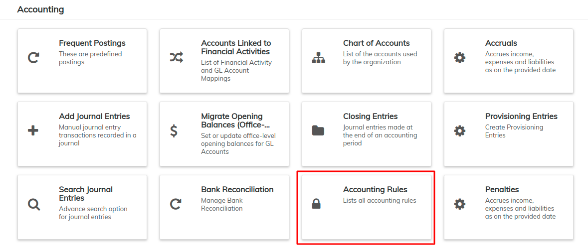
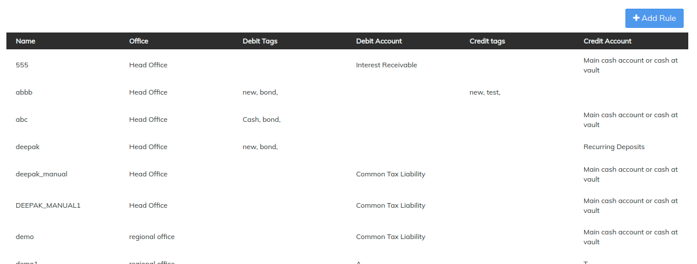
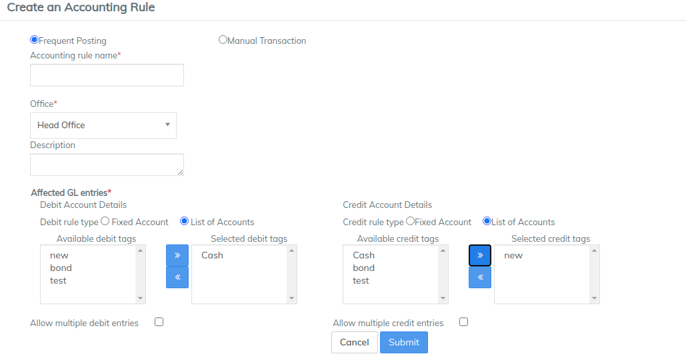
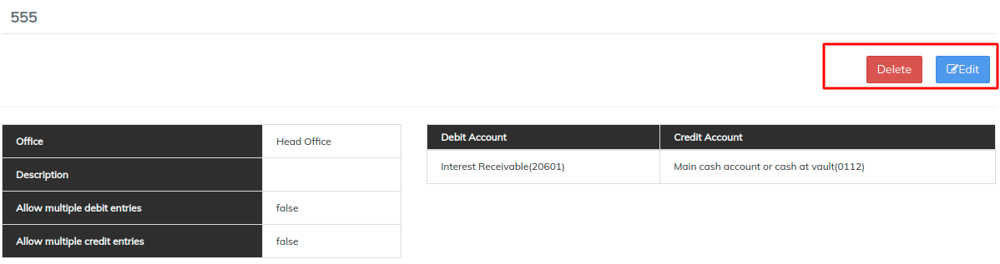

# Accounting Rules

LMS supports **Accounting Rules** to ease the accountant’s tasks and reduce errors.

Accounting Rules are preconfigured accounting transactions in which debit and credit accounts available for posting are defined.

For example, you can configure an Accounting Rule for a payroll that will display only the expense accounts related to payroll debits and only the asset accounts available for credits.

Later you could use Frequent Postings to add an entry to your journal entry.&#x20;

Beginning at the main screen, click on [**Accounting**](../initial-system-setup/accounting.md). This will launch the **Accounting** menu.

Select **Accounting Rules**

## Create accounting rule

Click on +Add Rule  the page shown below opens.

As illustrated in the image above, you need to provide details and click on **Submit** button.&#x20;

### **Multiple GL entries:**&#x20;

In case, you want to do multiple entries you need to create debit and credit Account Tags, and then assign the tags to expense and asset accounts. The tagged accounts can then be used to create an Accounting Rule.

For example: To create a payroll posting rule, create a debit Account Tag, “Payroll”, and assign it to each Expense Account you want available for payroll debits. Then create a credit Account Tag, “Cash,” and assign it to each Asset Account you want available for credits.


For creating Tags, go to [Manage Codes](../administration/system/manage-codes.md). Search for

* Asset account tags
* Equity account tags
* Expense account tags
* Income account tags
* Liability account tags


**Procedure**

To set the Debit rules:

1. Under **Debit** **Account Details,** select **List of Accounts.**\
   
2. &#x20;Select an account from the **Available debit tag** list, and then click the right arrow (**>>**) button to add the account to the **Selected debit tag** list. \
   **NOTE:** To allow multiple debit entries select **Allow multiple debit entries.**\
   &#x20;
3. To set the Credit rules:
   1. Under **Credit** **Account Details,** select **List of Accounts.**\
      
   2. &#x20;Select an account from the **Available credit tag** list, and then click the right arrow (**>>**) button to add the account to the **Selected credit tag** list. \
      **NOTE:** To allow multiple debit entries select **Allow multiple credit entries.**\
      
4. Click **Submit** to post your new accounting rule.

## **View / Edit / Delete Accounting rule**

To **Edit,** click on **Edit** button in blue, then modify necessary changes and click on Submit.&#x20;

To **Delete**, click on **Delete** button in red, then click on confirm.&#x20;


#### **To apply an Accounting Rule: Go to** [**Frequent Postings**](../../for-all-operational-users/accounting-operations/frequent-postings.md)**** 

