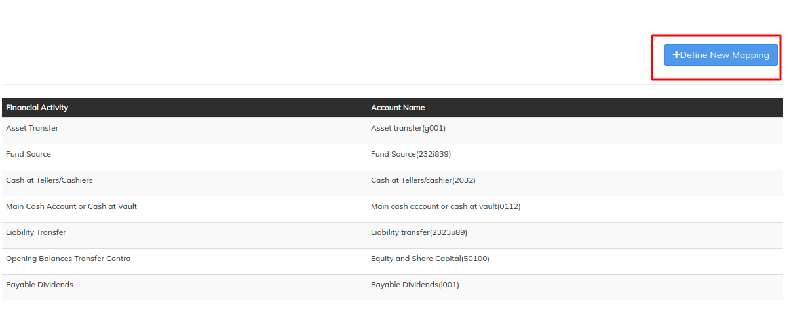

# Accounts linked to Financial Activities

Accounts linked to Financial Activities are mapped accounts which are needed to do system generating accounting transaction.&#x20;

Below are the accounts which are needed to be mapped respectively

* **Asset transfer** - Should be an Asset - Account type.&#x20;
* **Liability transfer** - Should be a Liability - Account type.&#x20;
* **Main cash account or cash at vault** - Should be an Asset - Account type.&#x20;
* **Cash at Tellers/cashier** - Should be an Asset - Account type, used for "Teller cashier management" feature.&#x20;
* **Opening Balances transfer contra** - Should be an Equity - Account type, used for "Migrate opening balances" feature.&#x20;
* **Fund source** - Should be an Asset - Account type.&#x20;


This mapping is essential if you are going to perform any of the below activities

* Client or loan Transfer ( Asset Transfer is must ) &#x20;
* Teller and cashier managemenr ( Cash at Teller is must)
* Migrating opening balances (Opening balances contra Account is must)
* Cash disbursement (Fund source is must)



Error: You will get below error if the financial activity mapping is not present.&#x20;

"Accounts linked to Financial Activity are not present"


Beginning at the main screen, click on [**Accounting**](../initial-system-setup/accounting.md). This will launch the **Accounting** menu.

Select **Accounts linked to Financial Activities**

## **Defining new mapping**

Click on "**+Define New mapping**"&#x20;

Select and edit the mapping as mentioned in the example below:-&#x20;

&#x20;   **Financial activity**: Opening Balances Transfer Contra&#x20;

&#x20;   **Account**: Opening Balances Contra Account(Equity account type)&#x20;

&#x20;   Then click on **Submit**.&#x20;

Key Error Messages


For the example above: Opening Balances Transfer Contra, you should have created an Equity **Account Type** from chart of account feature.

