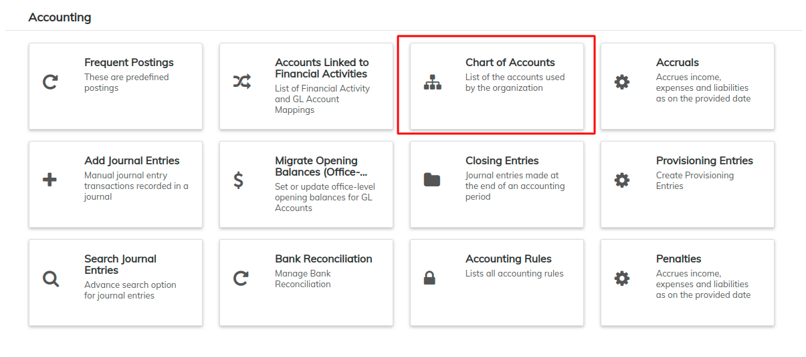
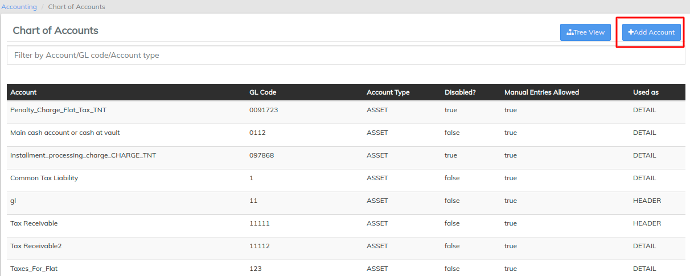
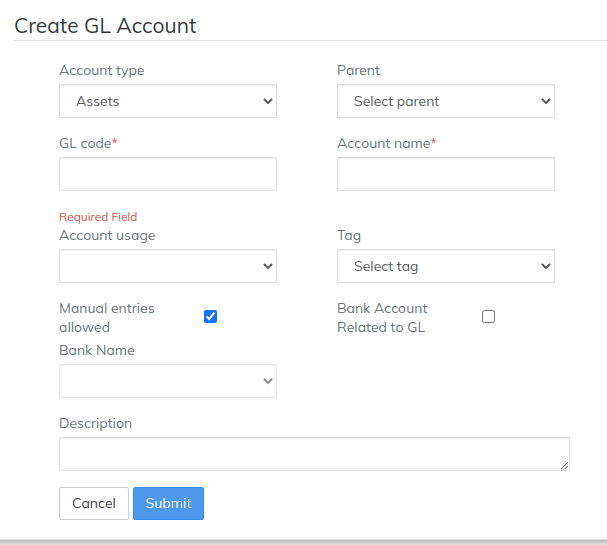
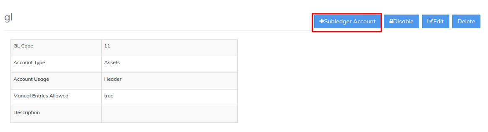
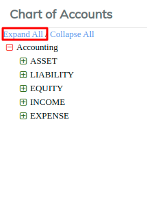
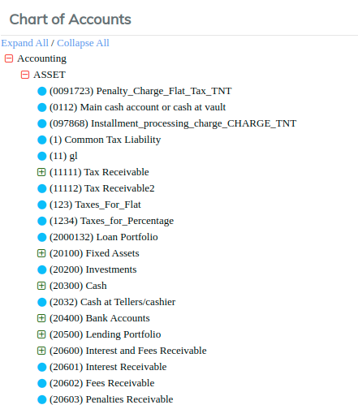
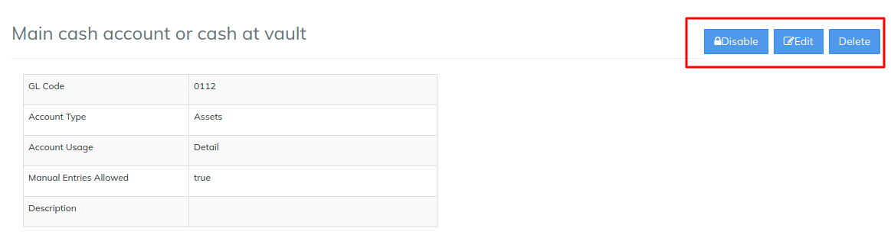

# Chart Of Accounts - Ledger setup

The **Chart of Accounts** - **General Ledger Setup** allows you to organize your different accounts within LMS. Accounts can be organized into Header and Detail (_sub_) accounts using the respective account types: Asset, Equity, Expense, Income and Liability.

Navigate to **Accounting** >> **Chart of Accounts** (_as shown in the screenshot below):_

Account usage is divided into **Header** accounts and **Detail** accounts. You could start creating with Header and then switch to a sub-ledger account afterwards. When setting up your accounts, it is advisable to set them up one at a time. For example _create all of your Header accounts for Assets and then set up all Detail accounts for Assets as well_. Follow the same sequence for other account types(namely **Equity, Expense, Income** and **Liability** accounts).

## **How to Create GL Account?**

1. On the Chart of Accounts page, click the  button at the top-right of the screen:\
   
2. Select the **Account Type** from the drop-down menu.\
   Furthermore, fill in the optional information on the right side of the screen if you wish to do so.\

3. Type the GL (General ledger) Code.\
   _For example: 10000_\

4. Select **Header** from the **Account Usage** drop-down menu.\
   \
   \
   \

5. Select a **Parent** from the drop-down menu (_if required_).\
   \

6. Type the **Account name**.\
   _For example: Cash & Bank_\
   \

7. To allow **Manual Entries**, click on the check box next to it to make sure it is checked.\
   \

8. Select a **Tag** from the drop-down menu. New Tags can be created from the [Manage codes](../administration/system/manage-codes.md) \

9. If this GL is related to any Bank account, You can enable the "**Bank Account Related to GL",** and the select the bank name. For adding bank name in the dropdown, go to [manage codes](../administration/system/manage-codes.md)\

## **How to Create Sub-ledger Account?**

The **Account Usage** option should be set to **Detail** if this sub-ledger account is used for passing journal entries.\
Further sub-ledgers cannot be created under this sub-ledger.

If you want to create a sub-ledger under this sub-ledger, set the **Account Usage** option to **Header** instead.\

1. From the Chart of Accounts page, click on the existing GL Account which has **Account Usage** set as as **Header**. This will redirect you to a new page. Click on :\
   \
   \
   \

2. Type the **Account name**.\
   \

3. Next, fill in the **GL Code**.\
   \

4. Select **Detail** from the **Account Usage** drop-down menu.\
   \

5. To allow **Manual Entries**, click on the check box next to it to make sure it is checked.\
   \
   .png>)\
   \

6. Next, fill in the optional information on the right side of the screen if you wish to do so.\
   \

7. Select the **Account Type** from the drop-down menu.\
   \

8. Select a **Tag** from the drop-down menu (which has been further documented in GL account creation).\
   \

9. Select a **Parent** from the drop-down menu.\
   \

10. Type a **Description** in the text box provided:\
    \

11. Click 

## **Overview of General Ledger Accounts**

Once you have navigated to the **Chart of Accounts** page, you will be presented with a chart of all the accounts being used by your organization. You may filter the results by typing any keyword in the **Filter by Account/GL Code/Account type** field. Alternatively, you may view this chart in a **Tree View** - please see the **View Chart of Account (Tree View)** section below to learn about this.

### **View Chart of Accounts (Tree View)** 

There is an alternative way to view your accounts - using the **Tree View**. From the **Chart of Accounts** page, click the the blue **Tree View** button at the top-right of the screen. ****&#x20;

You will be taken to a new screen (with the same title as the previous one) having only one entry, with a small '**+**' sign on the left:

Click on the '**+**' sign to expand the tree. A typical result may look like the one shown in the screenshot below. This is an effective way to examine the structure of your organization's accounts within the LMS system:

## **Edit, Disable or Delete an Existing Account**

You may edit, disable or delete an existing account by navigating to it's **Detail page**. You can do this by clicking on an account on the Chart of Accounts screen. Search for the account you would like to edit and click on it

Once you click on the desired account you will be taken to a screen with more details for that account. An example of this has been shown below (_note the three blue buttons to the right of the screen_):

* To **Disable** the selected account, click the blue **Disable** button at the top-right of the screen. To re-enable it, click the button again.\
  \

* To **Delete** the selected account, click the blue **Delete** button at the top-right of the screen. This will launch a pop-up window - click the blue **Confirm** button to confirm the deletion of the account.\
  \

* To **Edit** the selected account, click the blue **Edit** button at the top-right of the screen. This will launch the **Edit GL Account** page:


Import option of Chart of accounts is also available in the [Bulk Import Module](../../for-all-operational-users/bulk-upload-module/).&#x20;

