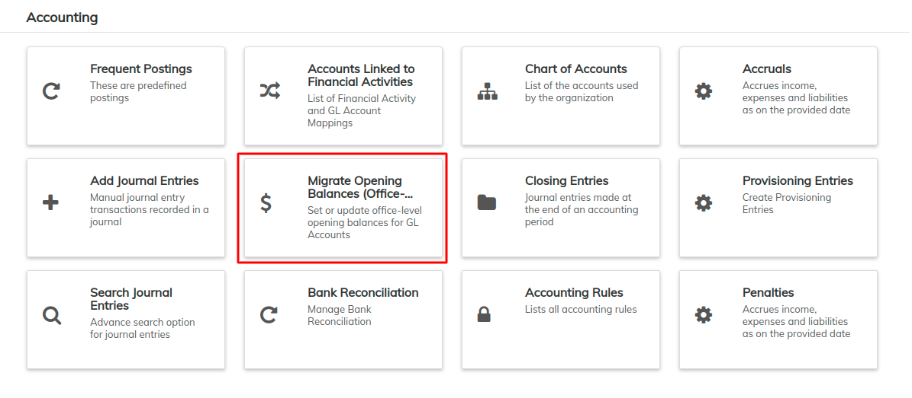
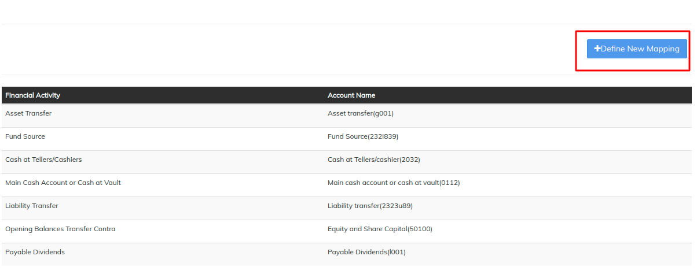
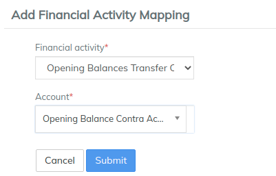
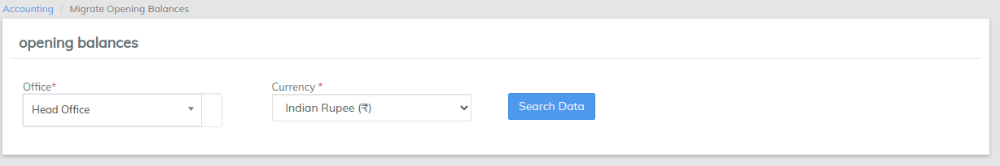
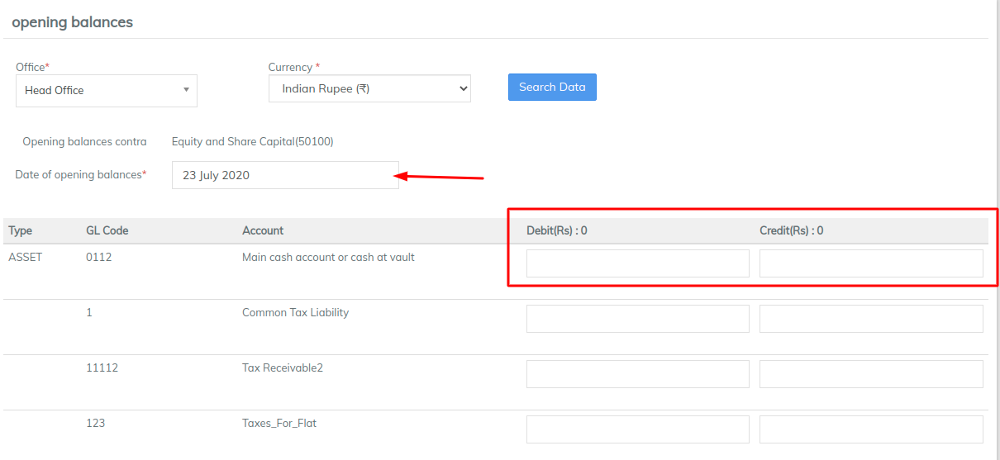

# Migrate opening balances

As a Head Accountant, I wish to set the opening balances for GL (General Ledger) accounts for a branch or an entire organization. This makes it easier for an organization wanting to move to LMS to transfer GL account balances (from their existing accounting application or manual system) to LMS Accounting.

Opening balances must be set before entering any journal entries in accounting system.

Beginning at the main screen, click on [**Accounting**](../initial-system-setup/accounting.md). This will launch the **Accounting** menu.

Select **Migrate Opening Balances**

### Step 1: Go to "Global configuration" (Admin>>System)&#x20;

Enable "office-opening-balances-contra-account"  \
\

### Step 2: Go to "Chart of accounts" (Admin>>Accounting)&#x20;

Create a Contra-account (for example. Opening Balances Contra-account, which would be an Equity account)


[chart-of-accounts.md](chart-of-accounts.md)


### Step 3: Go to "Accounts linked to Financial Activities" (Admin>>Accounting)

a) Click on "Define New mapping"&#x20;

b) Select and update the mapping as mentioned below:-&#x20;

&#x20;   **Financial activity**: Opening Balances Transfer Contra&#x20;

&#x20;   **Account**: Opening Balances Contra -account

&#x20;   Then click on Submit.&#x20;

### Step 4: Go to Migrate opening Balances (Admin>>Accounting)&#x20;

a) Select the desired office from the drop down

b) Select "**Date of Opening Balance**"&#x20;

&#x20;   Select "**Currency**"&#x20;

&#x20;   Enter **Debit balance - Amount** in the field box, with respect to your GL account.&#x20;

&#x20;   Enter **Credit balance - Amount** in the field box, with respect to your GL account.&#x20;

&#x20;   Then click on **Submit** button to pass the opening balance entries.&#x20;

Key Error Messages


Sum of Debit and Credit should be equal



Prior to this, no transactions should occur



&#x20;You should follow the mentioned conditions below before you pass the Opening balance entry:

* Either debit or credit balance may be specified for a particular account
* Both debit or credit balance may **NOT** be specified for a particular account
* Total debits should be equal to Total credit


### **View Opening Balances**

You can search the opening balances entry in view journal entries

### **What happens if Opening balances are set after entering any journal entries in accounting system:** 

Be cautious that **Opening balances** are set before making any journal entry in accounting system. If you fail to do so, you won't be able to set the opening balance. Below are a few scenarios which should not be done before setting opening balance.

**Scenario 1:Don't Define a Loan Product With Accounting Enabled:**

* If you are setting up opening balances, make sure that you don't have any loan product with accounting enabled.
* In case you have loan product with accounting enabled and this loan product is linked with any of the clients, you won't b able to submit opening balances.\
  So make sure that while setting up opening balances you don't have any loan product with accounting enabled.


defining.openingbalance.not.allowed

This error is thrown when accounting is enabled for product before migrating opening balances

