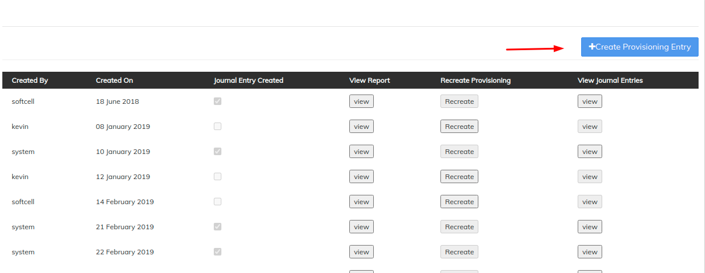
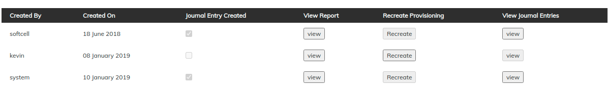

# Provisioning Entries

From the main screen, click on Accounting. This will launch the Accounting menu as shown below, from the menu Select Provisioning entries. ****&#x20;


You should have created [provisioning criteria](../administration/organization/loan-provisioning-criteria.md) and once a loan falls under arrears, provisioning entries will work.&#x20;


## **Create Provisioning Entries**&#x20;

**System generated** - Once the provisioning criteria is created on the loan areas depending upon the criteria set, then provisioning entries will be created automatically. A scheduler job "Generate loan loss provisioning" will execute this process. &#x20;

**Creating Manually** - Click on the blue **Create provisioning entries** button at the top-right of the screen.

This will launch a new page like the image shown below:&#x20;

**Complete** the required fields: &#x20;

Select **Date**. &#x20;

Check the check box for **Create Journal Entries**. If this is disabled, it will give you amount of provision for each product and office, but **won't** pass any accounting entry. It will be like Provisioning Simulation

Click on **Submit** button. &#x20;

## **View provisioning entry**&#x20;

1. **Created By** - Provide details of created by
2. **Created On** - Provide date of creation
3. **Journal Entry Created** - Check box confirms journal entry created. If journal entries are not created, then you can recreate the entries.&#x20;
4. **View Report** - Click on view button to view report
5. **Recreate Provisioning** - Click on recreate button to recreate provisioning
6. **View Journal Entries** - Click on view button to view journal entries.  Entries will only be available if journey entry false is true&#x20;

## View **Journal entry**&#x20;

* Office and product name's unique combination is shown as one record
* Currency code is shown
* Category name defined the bucketing using the loan provisioning criteria
* Liability Account - It comes from the [loan provisioning criteria](../administration/organization/loan-provisioning-criteria.md)
* Expense account - It comes from the loan provisioning criteria


Whenever you execute the new provisioning entries, the previous entries are reversed.&#x20;

Ex- If the loan of INR 10000 has 10% provisioning which is INR 100. Later the customer paid and now the provisioning bucket is 5%. If you re-execute the provisioning, It will reverse the INR 100 entry and create a new entry on INR 50.&#x20;

