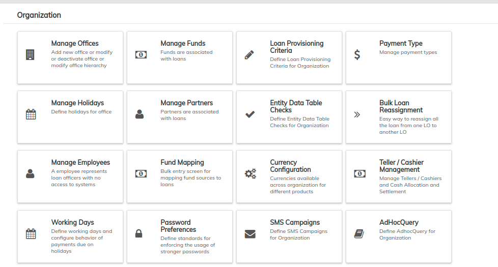

# Organization

The **Organization** menu contains links to 17 (_seventeen_) pages. These pages are listed on the right side of this page. Each of these will help you set up and customize LMS as per your organization's needs.

When getting started with LMS, please refer to the [**Initial System Setup**](../../initial-system-setup/) page.

Want to learn more about navigation in LMS? See the **General Navigation** section of this manual.

From the main screen, click on **Admin,** then click on **Organization** from the drop down list.

The **Organizations** page allows you to do several operations _(refer to the screenshot below)_:

* **Offices** can be created and modified
* **Holidays** can be created and modified
* **Employee** profiles and system access can be created and modified
* **Currency** settings can be established&#x20;
* **Loan** **Funds** can be created (such as Kiva.org, Rotary Funds, donor funds - any funds the organization needs to track)
* **Bulk Loan Reassignments** can be made
* **Standing Instructions History** enables viewing of logged history of standing instructions.
* **Teller / Cashier Management** enables managing Tellers/Cashiers - Cash allocation & settlement.&#x20;
* **Fund Mapping** enables the bulk entry screen for mapping fund sources to loans.
* **Working Days** can be defined here.
* **Password preferences** can be set for enforcing the usage of stronger password. &#x20;
* **Payment type** can be managed here, i.e creating & modifying.&#x20;

