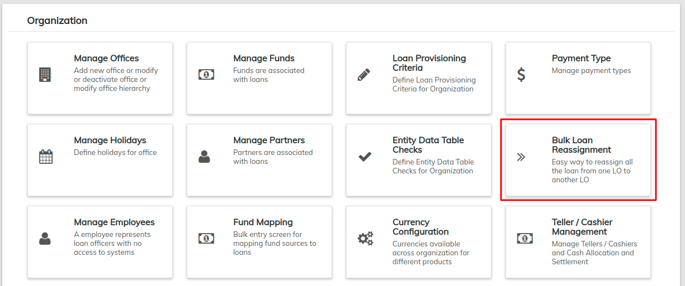
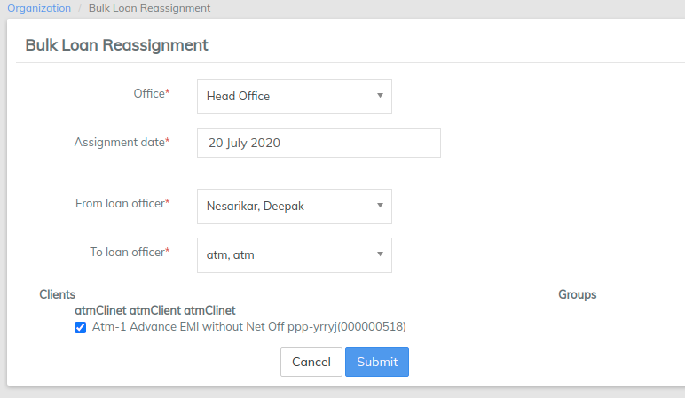

# Bulk Loan Reassignment

The Bulk Loan Reassignment tool is a very useful tool that allows you to transfer all of one loan officer's accounts to another loan officer. This tool is very useful in circumstances where a loan officer might be leaving the company or going on an extended leave.

### **Navigation**

From the Dashboard, click on the **Admin** button (_in the top menu bar_), then click on [**Organization**](./) from the drop down list that appears.

This will launch the **Organization** menu&#x20;

Select **Bulk Loan Reassignment**.

This will display a page that allows you to transfer all accounts from one loan officer to another. The following page will be displayed:

### **Transfer Loans**

Follow the steps below to transfer all loans assigned to a loan officer to a different loan officer. Please note that all are mandatory fields and loans can be reassigned to the loan officers from same office or different office.&#x20;

1. Select an **Office** from the drop-down list.
2. Select an **Assignment Date** by clicking on its respective field. This will launch a calendar from which you may select a date for the reassignment to take place.
3. Select the new loan officer from the **To Loan Officer** drop-down list.
4. Select all the loans which you want to transfer to the new loan officer
5. Click on **Submit**_**.**_
