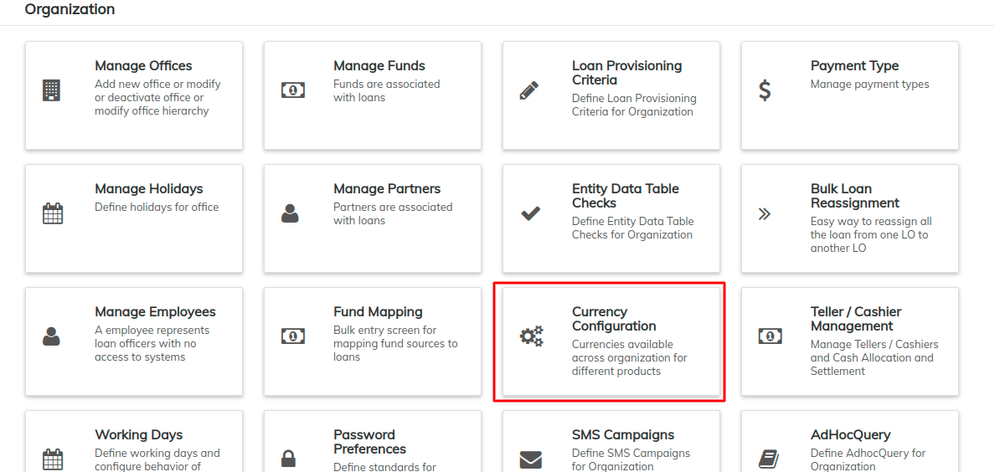
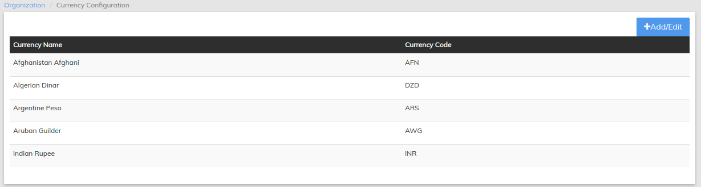
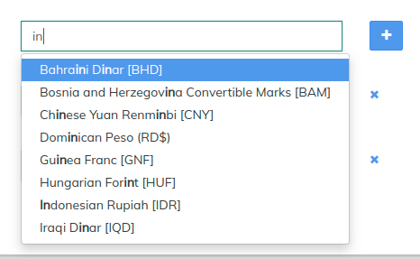

# Currency Configuration

As many of the operations within LMS take place on an international scale, a variety of currencies may be used. This section allows an organization to define what currencies will be used throughout their interactions within the LMS system.

From the [Welcome Page](../../../allusers/navigation.md#dashboard), click on the **Admin** button on the top menu bar, then click on **Organization** from the drop down list. This will launch the [**Organization**](./) menu.

Select **Currency Configuration**.

### ****

### **Add or Edit Currencies**

Follow the steps below to add or delete currencies from your organization's LMS profile. Chosen currencies will be displayed along with their currency code.

* Click the blue **Add/Edit **_****_ button at the top-right of the screen.\
  \
  \
  \

* This will display a list of all currencies currently in use. Click the blue '**x**' at the right of a currency to remove it from your organization's selected currencies.

* Type the name of the currency you would like to add into the **New Currency** field. LMS will automatically filter matches as you type.

* Click on the blue '**+**' to the right of the field to add the selected currency.
* Click **Submit** to commit your changes.
