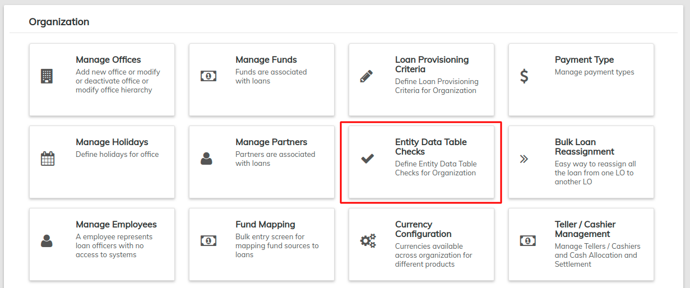
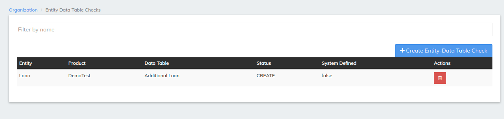

# Entity Data Table Check

For instance you need to check the existing Bank Account of the client before the creation of client. Then you can create your own [Custom Data Table](../../initial-system-setup/create-data-tables.md) with column **Existing Bank Account** and check the details before the creation of client.

## **How to create Entity Data Table Checks**

**Step 1:** From the main screen, click on **Admin** then **Organization** from the drop down list. This will launch the **Organization** menu. Select **Entity Data Table Checks.**

This will launch the **Entity Data Table Checks** page.

**Step 2:** Click the  **** button which will launch a pop-up box;

**Field description**&#x20;

| Field                  | Description                                                                                                                                                                                                                                                                                                                                                   |
| ---------------------- | ------------------------------------------------------------------------------------------------------------------------------------------------------------------------------------------------------------------------------------------------------------------------------------------------------------------------------------------------------------- |
| Entity (mandatory)     | This field describes which entity will undergo Entity Data Table Checks. Only four entities are supported with Entity Data Table Check and they are **Client, Group, Loan** and **Saving Account.**                                                                                                                                                           |
| Status (mandatory)     | This field describes when the specified entity should undergo Entity Data Table Checks. The status is not same for all entity and the statuses are **create, approve, activate, write\_off, withdrawn, rejected** and **close.**                                                                                                                              |
| Data Table (mandatory) | This field describes what need to be checked. These are custom data tables which are created in the manage table. Based on the Custom Data Table created, the additional screens are designed for the specified Entity during specified **Status**. All the columns given in the custom data table are displayed as fields in the additional screens created. |
| Product                | This field is enabled only for **Loan** and **Saving Account** entity. All the Loan Products are captured in the drop-down for Loan entity and all the Save product will be captured in the drop-down for Saving Account entity.                                                                                                                              |

* Any number of Entity Data Table Checks can be created for all the four entities.

## **Creating Client Entity - Data Table**&#x20;

Navigate to the **Entity Data Table Checks** page and then click the **+Create Entity Data-Table Check** button which will launch a pop-up box. Look through the previous section of this page to get details on how to navigate to the page.

From the **Entity field**, select **Client** from the drop-down menu.

For Client entity, only three statuses are provided.&#x20;

| Drop-down values | Description                                                               |
| ---------------- | ------------------------------------------------------------------------- |
| **CREATE**       | During the creation of Client, the Entity Data Table Checks are enabled   |
| **ACTIVATE**     | During the activation of Client, the Entity Data Table Checks are enabled |
| **CLOSE**        | While closing the Client, the Entity Data Table Checks are enabled        |

The Data Tables which are created are captured in the Data Table drop-down.

To create a Custom Data Table, select **Admin** from the top of the screen and choose **System** from the drop-down menu. Select [**Manage Data Tables**](../system/manage-data-tables.md) and click the **+Create Data Table** button. After creating a Data Table, you will find it listed in the Data Table drop-down menu:

For the created **Entity Data Table Check**, their respective pages are affected. For instance, an "Entity Data Table Check" for clients has been created for **CREATE** status. So the create client page consists of wizards as shown below. Here, two "Entity Data Table Checks" are created for create client via wizard i.e., **Client Bank Details** and **Family Details.** And their respective fields are created based on the data tables created in [**Manage Data Tables**](../system/manage-data-tables.md) **** page.

### Behaviour of Entity - Data Table checks

**Create Client**

This is a **create client** screen with additional wizard consisting **Client Bank Details** and **Family Details.** Only **CREATE** status will consist of wizards. For other status, additional tabs will be created.

&#x20;After clicking on proceed, the current screen navigates to the next page.&#x20;

**Create Client >> Create Bank Details**

This is an additional wizard created for **Client** entity and **CREATE** status with **Client Bank Details** data table as custom data table. **Bank Account Number** and the **Bank Branch** are the columns created in this custom data table. After clicking on proceed the current screen navigates to the next page.&#x20;

**Create Client >> Create Bank Details >> Family Details**

This is an additional wizard created for **Client** entity and **CREATE** status with **Family Details** data table as custom data table. Members and the Occupation are the columns created in this custom data table. Only after completing all the wizard screens the page will allow you to submit the Application.

If you are not providing the required details (only if the field is mandatory) then an error message is shown.

## Creating Group **Entity - Data Table Check**

*   Group Entity has the following Status&#x20;

    | Drop-down values | Description                                                               |
    | ---------------- | ------------------------------------------------------------------------- |
    | **CREATE**       | During the creation of Client, the Entity Data Table Checks are enabled   |
    | **ACTIVATE**     | During the activation of Client, the Entity Data Table Checks are enabled |
    | **CLOSE**        |  While closing the Client, the Entity Data Table Checks are enabled       |
* The data tables which are created are captured in the data table drop-down.
* To create custom data table navigate to **Admin>>System>>Manage Data Tables>>Create Data Tables.**\

.png>)

* Instance 1: A data table has been created for the activation of a Group and the custom data table name is "Group Details". Wizard is not facilitated for status other than create. Hence in the screen below, we can see a tab named by "Group Details" with Add button. Clicking on the Add button will navigate to the Group Details page.\
  ****\
  ****
* &#x20;**** As shown in the GroupDetails screen, the fields are captured based on the custom data table created by you.\

* If we are not provided the data to the custom data table based field and if we try to activate the Group, then an error message is shown as in the screen below.

Instance 2: A data table has been created for the Creation of Group and the custom data table name is "GroupBankDetails". Since the status is create the wizard come into picture. Hence in the screen below, we can see the wizard named by "GroupBankDetails" .&#x20;

As shown in the GroupBankDetails screen, the fields are captured based on the custom data table created by us.

## Creating Loan **Entity -  Data Table Check**

*   Loan Entity has 6 Statuses as that of Client. i.e.,

    | Dropdown Values | Description                                                            |
    | --------------- | ---------------------------------------------------------------------- |
    | **CREATE**      | During the creation of Loan the Entity Data Table Checks are enabled   |
    | **APPROVE**     | During the Approval of Loan the Entity Data Table Checks are enabled   |
    | **ACTIVATE**    | During the Activation of Loan the Entity Data Table Checks are enabled |
    | **WITHDRAWN**   | During the Withdrawal of Loan the Entity Data Table Checks are enabled |
    | **REJECTED**    | During the Rejection of Loan the Entity Data Table Checks are enabled  |
    | **WRITE\_OFF**  | During the Write\_off of Loan the Entity Data Table Checks are enabled |

* The data tables which are created are captured in the data table drop-down.
* To create custom data table, navigate to **Admin>>System>>Manage Data Tables>>Create Data Tables.**
* For loan entity an extra field is added i.e., Product. This field is visible only if the Loan products are already created. \
  \
  \
  \
  ****
* Instance 1: A data table has been created for approval of loan  and the custom data table name is "LoanDetails". Wizard is not facilitated for status other than create. Hence in the screen below, we can see a tab named by "LoanDetails" with Add button. Clicking on the Add button will navigate to the LoanDetails page.

.png>)

* &#x20;**** As shown in the LoanDetails screen, the fields are captured based on the custom data table created by us.

 (2).png>)

* If we are not providing the data to the custom data table based field and if we try to approve the loan, then an error message is shown as in the screen below:

 (1).png>)

Instance 2: A data table has been created for the creation of loan account and the custom data table name is "FamilyAnnualIncome". Since the status is create the wizard comes into picture. Hence in the screen below, we can see the wizard named by "FamilyAnnualIncome".&#x20;

.png>)

As shown in the FamilyAnnualIncome, the fields are captured based on the custom data table created by us.

 (1).png>)


You also get REST APIs for each data table so that you push and store data which is required for your client and loan servicing


