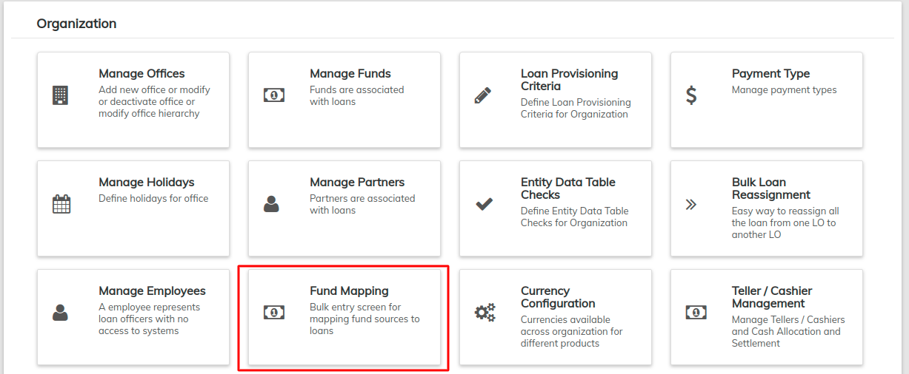

# Fund Mapping

The **Fund Mapping** page enables you to map the sources of funds to loans in bulk.

Beginning at the main screen, select **Admin,** then **Organization** from the drop down menu. This will launch the **Organization** menu.

Select **Fund Mapping** to set the preferences.&#x20;

This will launch an **Advance search** page.          &#x20;

Using Adhoc query search, one can search for loans with different aspects. You can search by;

* Loan Status
* Product
* Office
* **Approval/Creation/Disbursement - Date**
* **Loan outstanding percentage**
* **Loan outstanding amount**

## **Searching by Loan Status**

|  |
| ---------------------------------------------------------------------------------------------------------------------------------------------------------- |

The options include;

* All - Searches loan with all status.&#x20;
* Active - Searches only loan with Active status.
* Overpaid - Searches only loan with Overpaid status.
* Closed (obligations met) - Searches loan Closed (obligations met).
* Closed (written-off) - Searches loan Closed (written-off).

## **Searching by Product**

This is a filtered search based on Products. That is clicking on a particular product or by holding the control button and selecting two or more products and then search. &#x20;

|  |
| --------------------------------------------------------------------------------------------------------------------------------------------------------- |

## **Searching by Office**

This is a filter search based on the Office.&#x20;

|  |
| -------------------------------------------------------------------------------------------------------------------------------------------------------- |

You can click on a particular office or many by holding the control button and selecting the offices.

## **Searching by Approval/Creation/Disbursement-Date**

This is a filter search based on the type of date. This can be Approval date, Creation date, and Disbursement date.

\
You can be provided a range of dates within which you want your results to be based.

## **Searching by Loan Outstanding Percentage**

By default, it will have the check box checked for Loan outstanding percentage. If you don't want to use this filter,  un-check the box and then search. &#x20;

By default, it will be a between search. However, you may select another option from the drop-down and then select the range of dates.&#x20;

## **Searching by Loan Outstanding Amount**

By default, this section will have the check box checked for Loan outstanding amount. If you don't want to use this filter, un-check the box and then search. &#x20;

By default, it will be a between search. However, you may select another option from the drop-down and then select the range of dates. \
Click the  button to execute your filtered search. &#x20;

