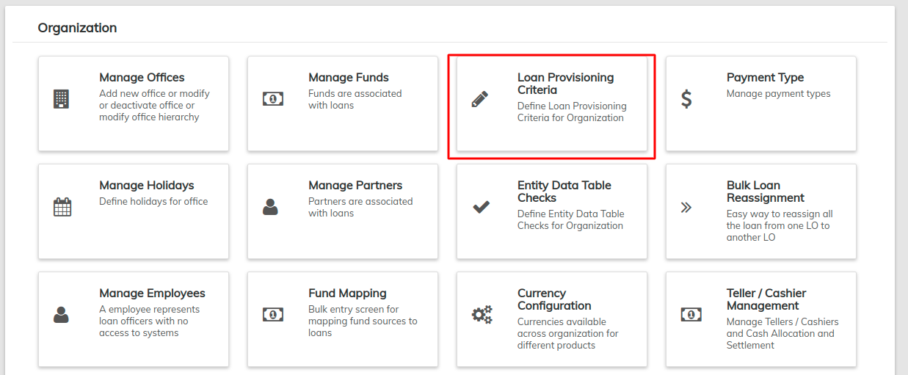

# Loan Provisioning Criteria

Loan loss provision is also known as the "**Valuation Allowance**" or "**Valuation Reserve**". It is also known as "**Allowance for Loan Loss**"                             &#x20;

In any group of loans, banks (used to refer to all financial institutions) expect that there can be some loans that do not perform as expected. These loans may be delinquent on their repayments or default the entire loan. This can create a loss to the bank on expected income. Therefore, banks can set aside a portion of the expected repayments from all loans in its portfolio to cover all or a portion of the loss. In the event of loss or in critical situations, banks can use that amount set aside to cover the loss instead of taking a loss in its cash flow. This loan loss reserve acts as an internal insurance fund.

From the main screen, click on **Admin** then **Organization** from the drop down list.This will launch the [**Organization**](./) menu.&#x20;

Then Select **Create Provisioning Criteria.**&#x20;

This will launch the Provisioning Criteria page that displays the name of the loan provision and who created it.

## **Create Provisioning Criteria**

Click the  button at the top-right of the page. This will launch a new page as shown below:

Complete the fields provided:

1. Provisioning Criteria:- Choose an appropriate name for the Provisioning criteria.
2. Choose the products to which the provisioning criteria should apply. Simply select a product from the **All products** list and add it to the **Selected product** list by clicking the  button.&#x20;
   1. To select multiple products, select one and hold the Ctrl button on your device to select the other products. 
   2. To remove a product from the selected list, simply select the product you want to remove and click the  button.
3. For each of the categories in the next section, provide;

* **Min Age** - Provide minimum number of days, example: 1&#x20;
* **Max Age** - Provide maximum number of days, example: 30&#x20;
* **Percentage** - Provide percentage value.&#x20;
* **Liability Account** - Select respective liability account.&#x20;
* **Expense Account** - Select respective expense account.&#x20;

Check to confirm your input and then click the **Submit** button.


You could go to [Provisioning Entries](../../accounting/provisioning-entries.md) for the creation of provisioning entries.

