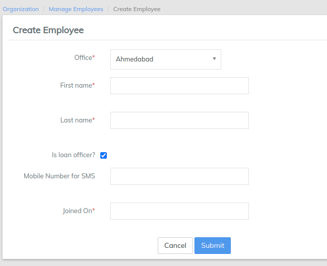

# Manage Employees

**Employees** are people within your organization who do not have access to the LMS system. They are used to distinguish between the various types of staff as well as their roles and permissions (for instance: it designates loan officers and provides the ability to assign a loan officer to a client, group or loan).&#x20;

From the Dashboard, click on the **Admin** button on the top menu bar and click on **Organization** from the drop down list. This will launch the [**Organization**](./) menu.

Select **Manage Employees**.

A list of all employees will be displayed:

### **Add Employees**

Click the  button at the top-right of the page to create a new employee.

1. Fill the following **mandatory** fields (_denoted by a red asterisk "\*"_):
   * Select the appropriate office from the **Office** drop-down menu.
   * Enter the employee's **First name.**
   * Enter the employee's **Last name**.
   * Provide the **Joining Date** of the employee.\

2. Furthermore, fill the following **optional** fields:
   * &#x20;Designate the employee as a loan officer (if required) by checking the "**Is loan officer?**" checkbox.
   * Add a **Mobile Number for SMS** to allow messages via text.

Click on **Submit** once you are done.

### **Import Employee**

You can also import employee details from your local device. Click the  button at the top-right of the page (_next to the blue Create Employee button_) on the **Manage Employees** page.

This page has three sections (_as shown below_):

* Employee Template
* Import Employees
* Documents

If you want to use an already existing template, go to the **Employee Template** section.

Select an office template in the **Select Office** drop-down menu. Click the **Download** button to the right of the search field. This will download a spreadsheet file in which you can add employee details. For example: let's assume we selected the **Main Head Office** template and the downloaded spreadsheet includes the following fields:&#x20;

* Office Name
* First Name
* Last Name
* Loan Officer
* Mobile Number
* Joining date
* External Id
* Status

####  

Once you have filled the details in the spreadsheet, save it and then import the file into LMS in the **Import Employees** section of the page.

Click the grey **Choose File** button, navigate to where you saved your file, select it and then click the blue **Upload** button to import your employee details.

In the **Documents** section at the bottom of the page, click the **Refresh** button to confirm that the file has been uploaded and can be used in LMS.

### **View Employees**

Once you have selected **Manage Employees,** a chart of all employees will be displayed with the following information:

* The employee's **Name**
* Whether the employee **Is a Loan Officer** or not
* The employee's **Office**
* The employee's **Status**; whether true or false


Use the **Filter by Name** field to quickly locate the employee you are searching for. Begin typing the employee's name and LMS will automatically filter the results.


Clicking on an employee's name on the chart will open that employee's **Profile**:

### **Edit Employee**

Click the blue **Edit** button at the top-right of the employee's profile to edit the employee's information. This will launch a new page where you may change the employee's information:

Once the appropriate changes have been made, click **Submit**.


An employee is not the same as a User (and is not interlinked with Users). Therefore, you may need to create users separately. Please see the [Users](../users.md) section of this manual to learn more. In short, All users are the employees. But all employees may not be the users.&#x20;

