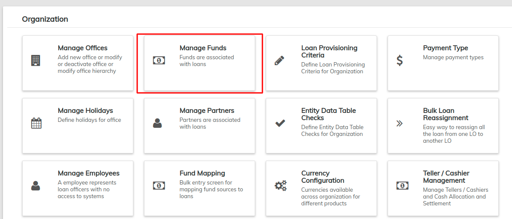

# Manage Funds

From the Welcome Page, click on the **Admin** button on the top menu bar, then click on **Organization** from the drop down list. This will launch the [**Organization**](./) menu.

Select **Manage Funds**.

### **Add Funds**

This section provides an option for adding funds that will be used for lending. Any fund that requires tracking can be set up under a fund name. Add funds by following these steps:&#x20;


**T**his fund is not interlinked with the Accounting section.


1. Type the name of the new fund in the **New Fund** field.
2. Click the blue '**+**' sign to the right of the field to create a New Fund.

### **View Funds**

Once you have selected **Manage Funds,** a chart of all currently tracked funds will be displayed. Additionally, a blank field will be displayed on top of the page that allows you to create new funds _(see the **Add Funds** section of this page to learn more)_.&#x20;

### **Edit Funds**

Click on **Edit** button  to modify the **Fund Name.**

This will allow you to edit the Fund Name. Click on the **Save** button to save changes.&#x20;

For more details on this process and the way funds are distributed, please see the [**Products**](../../products-1/) section of this manual.
