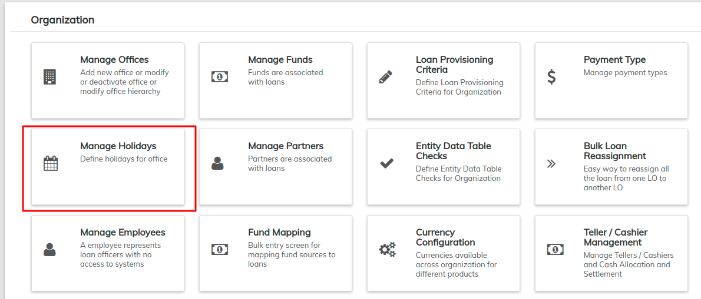
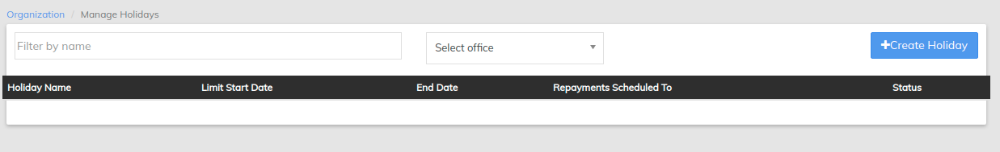

# Manage Holidays

The ability to manage holidays for individual offices is a very useful tool for an organization spanning multiple locations. Use this option to customize holidays for each office of your organization.

From the [Dashboard](../../../allusers/navigation.md#dashboard) Page, click on **Admin,** and click on **Organization** from the drop-down list that pops up. This will launch the [**Organization**](./) menu (_as shown in the screenshot below_).

From this menu, select **Manage Holidays**. This will display the following:

### **Add Holidays**&#x20;

This option allows you to create new holidays for each office in your organization.&#x20;

1. Click the blue **Create Holiday** button at the top-right of the screen: .This will launch a new page: \
   \
   \
   \

2. **Fill** the required fields:&#x20;
   1. Name
   2. From Date
   3. To Date
   4. Repayment Scheduling Type  &#x20;
   5. Repayment scheduled to
   6. Description (this is not a required field, but is still available. You may also **Edit** this holiday at another time to add a description or edit the current description).\
      \

3. **Select** the office(s) the holiday applies to by clicking on the small '**+**' icon beside **Applicable Offices**. This will open a list of offices for you to choose from. Check the boxes to mark the office(s) you would like to include.\
   \
   \
   \

4. Click **Submit**.

### **View Holidays**

&#x20;Once you have selected **Manage Holidays,** a chart of all holidays will be displayed. The following fields will be displayed:

* Holiday Name
* Start Date
* End Date
* Alternate working day
* Status - Active or Deleted


Use the **Filter by Name** field to locate the holiday you are searching for. Begin typing the holiday name and LMS will automatically filter the results.


### **Edit/Delete Holiday**

To **Edit** this holiday:

1. Click on a holiday in the list to view more details:\
   \
   \

2. Click on the blue **Edit** button at the top-right of the page. This will launch a page where you can change the name of the selected holiday. You may also add or change a description of the chosen holiday.

To **Delete** this holiday:

1. Click the red **Delete** button at the top-right of the screen.
2. Click **Confirm**.
