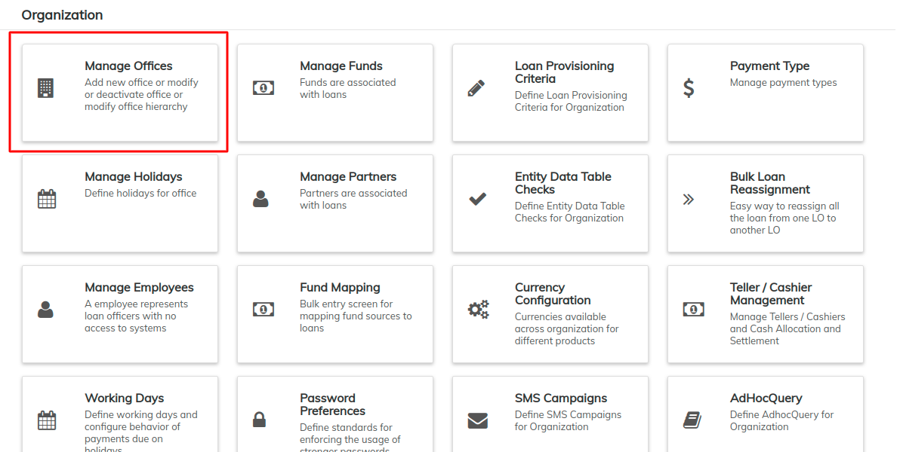
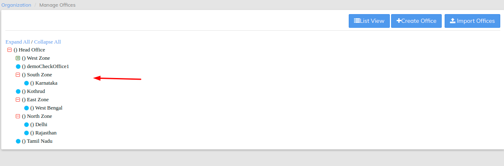

# Manage Offices

The **Manage Offices** page allows you to create, edit, and add the offices within your organization.


It is best to set up your head office first. Then set up any regional offices. Finally set up the individual branch offices taking care to link them to the correct regional or **Parent Office.**


Beginning at the main screen, select **Admin,** then **Organization** from the drop down menu. This will launch the [**Organization** ](./)menu.

Select **Manage Offices** to create a new office or modify current offices.

This will launch the **Manage Office** page that displays a list of created offices along with their external ID, parent office and day of opening.

### **Setting Up The Main Office**

Using the information gathered in the [Pre-Configuration Plan.docx](https://mifosforge.jira.com/wiki/download/attachments/73466161/Pre%20Configuration%20Plan.docx?version=1\&modificationDate=1442284208955\&api=v2), the first step is to create the Main Office of your organization. Select the  button at the top-right of the **Manage Offices** page.

Once the page launches, you can then create an office with the following fields;

1. In the **Office** field, enter your main office name. This may be a building name, a road name or any other naming scheme your particular organization uses.
2. In **Parent Office**, _do not enter a name_.
3. In the **Opened** on field, enter the date your organization opened this office.
4. In the **External ID** field, enter any numeric identifier your organization may use to further identify your offices. This is an optional field provided for your unique customization. It is not required for effective LMS functionality.
5. Review the information entered and if it is all correct, click the **Submit** button. The head office is now created.

### **Edit Office**

From the **Manage Offices** screen, select the office you want to edit from the listed offices.

Once you have selected an office, you will be taken to its detail screen. Click the blue **Edit** button at the top-right of the screen:

From the **Edit Office** screen you may change the Parent office, rename the Office, change the Opened on and give the office an External ID.

After making changes, click the **Submit** button to save those changes.

### **Creating Branch Offices**

If your organization has multiple offices, return to the **Admin/Organization/Manage Offices** screen and select **+Create Office**.  In this example, we use the name "Branch Office".  You will enter the name that best describes your additional office name.

1. In the **Office** field, enter your additional office name.
2. In **Parent Office** field, the name of your Head Office will be the default. If your organization uses regional offices, multiple office names will appear in the drop down and you will select the regional office this newly created office falls under.
3. In the **Opened on** field, enter the date your organization opened this office.
4. In the **External ID** field, enter any numeric identifier your organization may use to further identify your offices. This is an optional field provided for your unique customization. It is not required for effective LMS functionality. In this example, we used a numeric identifier for this office.
5. Review the information entered and if it is all correct, click on the **Submit** button. The additional office is now created.

&#x20;__ After the offices are set up, the full list will appear on the **Admin/Organization/Manage Offices** screen.

### **Tree View**

Your organization's offices may also be viewed in a **Tree View.**&#x20;

From the **Manage Offices** screen, click the  button at the top-right of the screen. This will launch an alternative view which allows you to view the office hierarchy for your organization:

To expand the office to expose the branches, click the  button besides the office name. To collapse, click the  button.

To return to list view, click the button at the top-right of the page.

### **Import Offices**

At the top most right of the **Manage Offices** page, click the  button. This will launch the **Bulk import/Offices** page.

You have two options;

1. &#x20;You can either download an office template to your device, add the information required, save and then upload that file.
2. &#x20;Or, if you already have an existing file, you can choose the file and upload it.


It is best to download an office Template as it will contain the fields that pre-exist in LMS.


After uploading the file, click the  button at the bottom of the page to confirm that the file has been uploaded.
