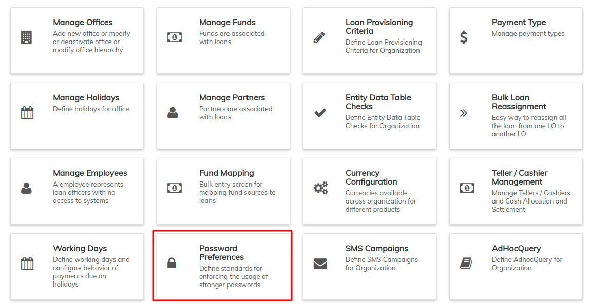

# Password preferences

Once the preference is set depending upon the set preference, it allows us to create password as per the mentioned conditions. The two preferences are: one is simple but weak and the other is a second preference which is strong. &#x20;

Beginning at the main screen, select **Admin,** then **Organization** from the drop down menu. This will launch the [**Organization**](./) **** menu.

Select **Password Preferences** to set the preferences.

This will launch the **Password Preferences** page:

## **Setting Up the Password Preferences**

On this page, there are two preferences;

1\. Password must be at least 1 character and not more than 50 characters long. This means that the provided password should satisfy these conditions;

* Must have a **minimum** of 1 character
* If you decide to use more than one character, then the password must not contain more than 50 characters
* The characters can be of any kind (letters, numbers and symbols) but **Not** the '**&**' symbol.

2\. Password must be at least 6 characters, no more than 50 characters long, must include at least one upper case, one lower case letter, one numeric digit & no space. This means that the provided password must satisfy these conditions;

* Must have a **minimum** of 6 characters
* If you decide to use more than 6 characters, then the password must not contain more than 50 characters
* Must include at least one upper case letter.
* Must include at least one lower case letter.
* Must include at least one numeric digit (number).
* Must not have space. There must not be any space between the characters.
* The characters can be of any kind (letters, numbers and symbols) but **Not** the '**&**' symbol.

Select your preference and then click the **Submit** button.&#x20;
