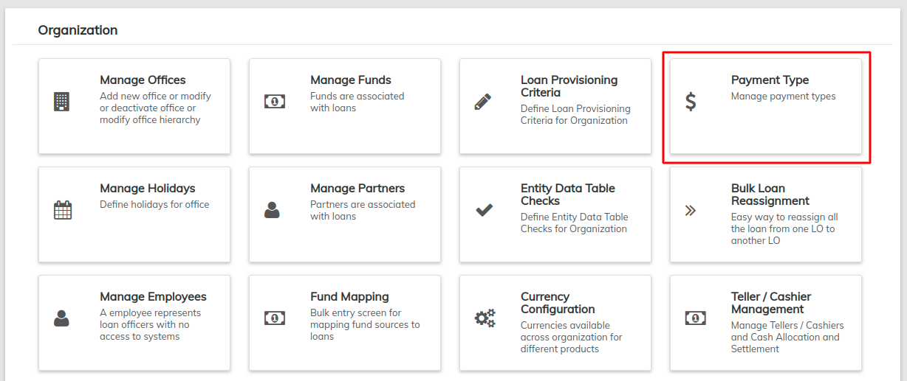
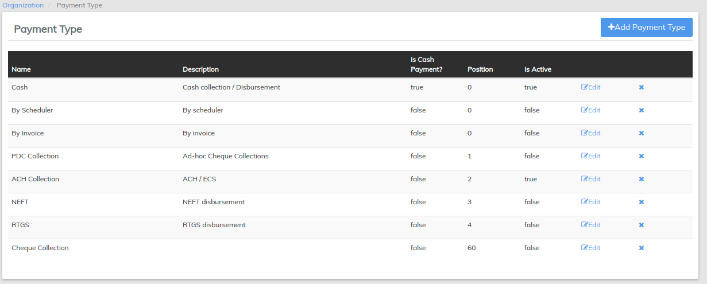
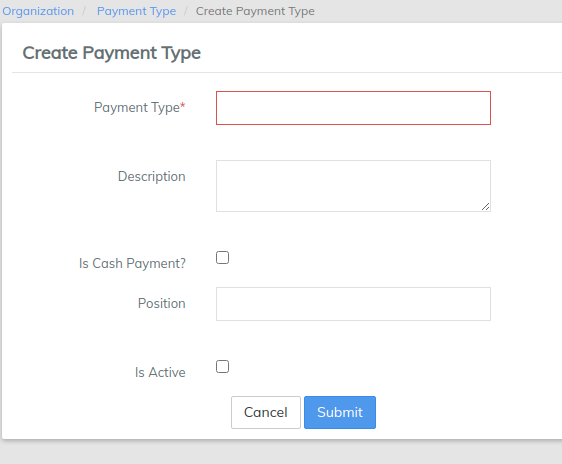
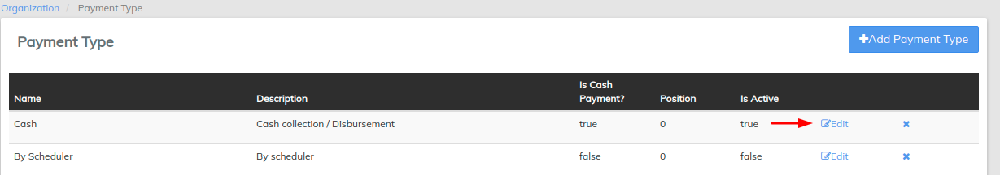

# Payment Type

Beginning at the main screen, select **Admin,** then **Organization** from the drop down menu. This will launch the [**Organization**](./) **** menu.

Select **Payment type** to specify types of payment you will accept.

This will launch the **Payment Type** page that displays a list of types of payments, their description, position and whether the payment is a cash payment or not.

## **Adding a Payment Type**

Click the  button at the top-right of the page. This will launch the **Create Payment Type** page:

To create a payment type, follow these steps:&#x20;

1. **Payment type** - Fill in an appropriate name of your choice. In the example below, Payment type is Mobile Money.
2. **Description** - Input the description of the mentioned payment type.&#x20;
3. **Is Cash payment?**- Check the check box if the payment type is a Cash payment. In the example below, the box is left un-checked since the payment is not in cash.&#x20;
4. **Position** - Provide the position number to list in the provided drop down menu.&#x20;
5. Check your input and if complete, click the **Submit** button.

## **Edit Payment Type**

Click the **Edit** button at the right of the payment type you want to modify.\
****

This will launch the Edit Payment type page in which you can modify the details of the type of payment.

When you are done modifying the payment type, click the **Submit** button.

## **Delete Payment Type**

To delete a payment type, Click the  button at the extreme right of the payment type.
