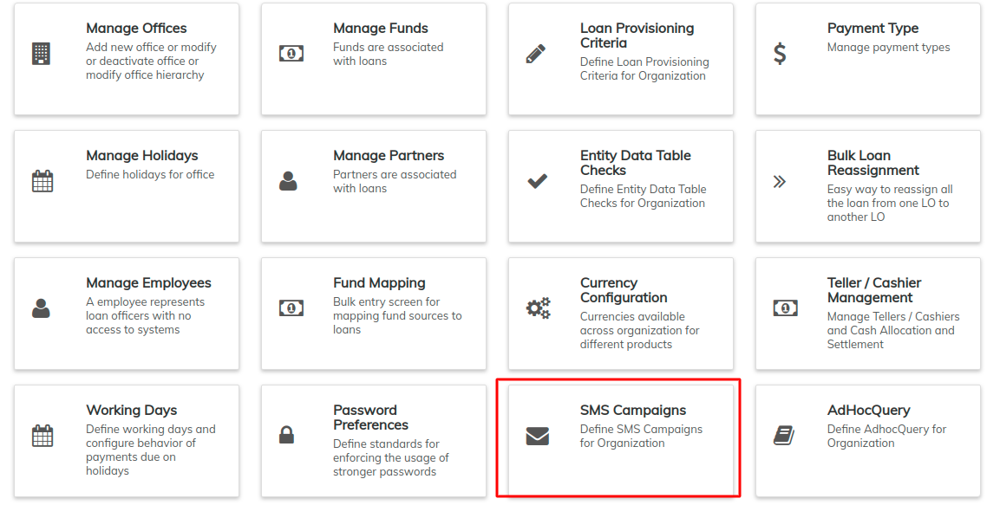
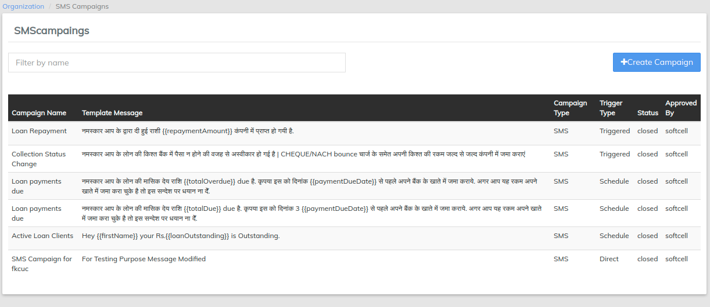

# SMS Campaigns

## **Configure SMS gateway in External Services**

For creating SMS campaigns, first step is to configure the SMS gateway credentials in the LMS. You can go to [External Services](../system/external-services.md#configuring-message-gateway-in-platform) to know more about it.

## **How to Create SMS Campaigns**

**Step 1:** At the top the screen, navigate to **Admin** and select **Organization** from the drop-down menu.

Select **SMS Campaigns**

**Step 2:** On the **SMS Campaigns** page, click on  button to create a new SMS Campaign

**Step 3:** Here you find a three step process from **Campaign** to **Message** to **Preview**. At the campaign stage, fill out these details;

Define the "**Message Details**" for the SMS Campaign.

* **Campaign Name:** Provide a name for the SMS Campaign.
* **Is Notification:** By default, the campaign is not a notification and therefore you are required to provide the SMS Provider. If the campaign is of notification kind, please check the check box. This will disable the SMS provider section and you may then proceed to the trigger type.

When it **Is** **Not** a Notification;

* **SMS Provider:** Select the appropriate SMS provider from the drop down menu.

When it **Is** a Notification;

No need for SMS provider

* **Trigger Type:** You can set "Trigger type" as either 'Direct', 'Scheduled', or  'Triggered'. Choose one from the drop down menu.
* Choose **Direct** when you want to send the SMS only once.
* Choose **Scheduled** if you want to send multiple SMS for a particular 'date' and 'Time'.
* Choose **Triggered** when you want to send 'transactional' SMS (For Example: Loan Repayment, Savings Deposit, Savings Withdrawal, etc. Currently 9 types of transactional campaigns are supported)

If you select Direct or Triggered, you may then proceed to the Business Rule part of the page. However, if you select Scheduled, then you will be required to provide additional information like **Schedule Date** and **Schedule Time**;

* **Scheduled Date:** Choose the date you want the campaign to take place or start (in the event that the campaign will not be for a day)
* **Scheduled Time:** Choose the time you want the campaign to run. Also select when you want the campaign to be repeated and the interval of repetition.
* **Business Rule:** Select the appropriate business rule from the drop down menu. Depending on the option you choose, a new set of sections will be displayed under the **Business Rule Parameters** section at the end of the page. As an example, we select Loan Payment Due as Business Rule and the Business Rule Parameters are Office, From X Number and To Y Number.

Depending on your Business Rule selection, fill in the required fields.

* Check to confirm your inputs and then Click 

**Step 4:** Next is the **Campaign Message** Section.&#x20;

The Available Template Parameters vary according to the Business Rule you selected in the previous section.

Choose those which apply to the campaign message you wish to broadcast. These available templates act as placeholders for the various options. For example, if you want to capture the first name of the client in the message, select firstName and it will be added into the Campaign Message textbox.

* After composing your message and adding the placeholders provided, click .

**Step 5: Preview** avails you the opportunity to check the information you have provided. Click the button to finish.

After which, you can then choose to activate the campaign or edit.

## **How to Activate an SMS Campaign**

From the general list of SMS Campaign, select the Campaign you want to make active. This should launch the details of the campaign like the screenshot below:

Click the Activate button which will launch a pop-up dialog box in which you should provide the current date.

If you want the campaign to begin on another day, you have to wait till that day arrives and then you provide that date in the Activate date field.

Also you may not be able to edit the details of the campaign once you Confirm. Ensure that the provided details are according to your preference.

After choosing the date, click the **Confirm** button.

Your SMS Campaign has successfully been created and marked active in the general SMS Campaign page.

&#x20;**** From the SMS campaign window, you can see the SMS campaign names that are at the **active,closed** and **pending** stages.

## **How to check the status of the SMS**

To check the status of your campaign, select the campaign from the general SMS Campaign page. At the top of the campaign details, there are tabs with the different campaign statuses. Select the status you want to view.

In each case, set "**From Date**" and "**To Date**" parameters. This will provide a list of SMS if applicable.

## Run SMS Scheduler Job

To send pending SMS, please run the scheduler job "**Send Messages to SMS Gateway**". This can be achieved by navigating to **Admin**>>**System**>>[**Scheduler Jobs**](../system/manage-scheduler-jobs.md)**.**


Now, you can also create Multi-Lingual SMS for customers

