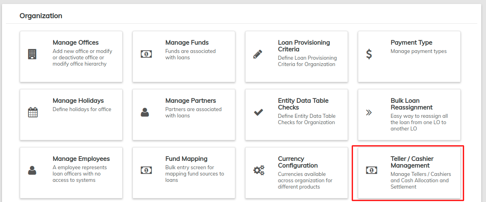
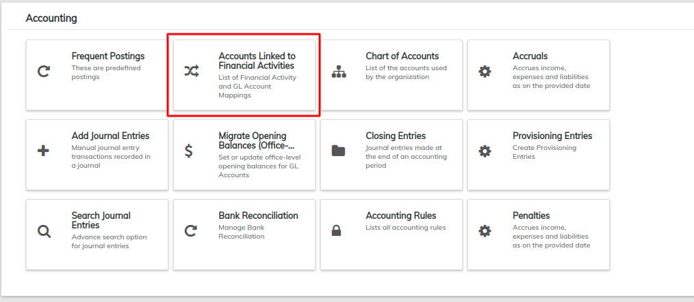

# Teller / Cashier Management

LMS allows an organization to set up cash drawers for proper cash management and reconciliation.

From the Dashboard screen, click on **Admin** then **Organization** from the drop down list. This will launch the [**Organization**](./) menu.

Select **Teller/Cashier Management**


Before setting up tellers, check the Financial Activity Mappings located under **Accounting** and then map the main cash account to the bank account as well as map the cash at tellers GL to the change fund GL.


## **Add Financial Activity Mapping**

Select **Accounting** from the main tab and then select **Accounts Linked to Financial Activities**

This opens a page that displays the financial Activity of an account and the Account name.

Click on the blue **Define New Mapping** button at the top-right to add a financial activity mapping.

For Financial activity, select **Cash at Tellers/Cashiers** from the Asset Transfer drop-down list. Also select the Account whose financial activity you want to map.

Click the **Submit** button.

## **Add Teller**

See the [**first**](https://mifosforge.jira.com/wiki/pages/resumedraft.action?draftId=86114424) section to navigate to to the **Teller/Cashier Management** page.

A list of current tellers is displayed with their branch, status and start date. To add a teller, click on the blue **+New Teller** button at the top-right.&#x20;

Provide Teller details with dates and also ensure to select status as "Active" in-case you want to enable that. Otherwise you could disable it by selecting "In-active".

Click the **Submit** button.

## **Add a new Cashier for Teller**

On Tellers page, select a Teller. This will display an empty list if the teller was not assigned a cashier.

Click on the **+ New Cashier For Teller** button on the top-right.&#x20;

Select the Cashier or Staff member you want to assign to that teller. This cashier should have been defined in the [Manage Employees](manage-employees.md) section.

Provide the dates within which the cashier is assigned to the teller.

Click on **Submit** button.&#x20;

## **Edit Cashier**

Select the  button on the Cashier page. This will display the details of the Cashier.

Select the **Edit** Button at the top-right which will display a page that will permit you to edit.

After editing, click the **Submit** button.

## **View Teller transactions**

&#x20;On Tellers page, select a Teller. This will display details of the teller such as the cashiers who worked on that teller and the period they worked.

Click the first blue button to be able to view the transactions of that cashier.

This will display the details of transactions that occurred under that cashier.&#x20;

## **Allocating Cash**

Select the  button from the **Cashiers** page and this will display the Allocate Cash page.&#x20;

Select date and currency, and provide amount value and notes.

Click the **Allocate Cash** button to submit.

## **Settling Cash**

Select the  button from the **Cashiers** page which will display the Settle Cash Page.

Select the date and currency, and provide the amount and notes on the Settle Cash page.

Click the **Settle Cash** button
