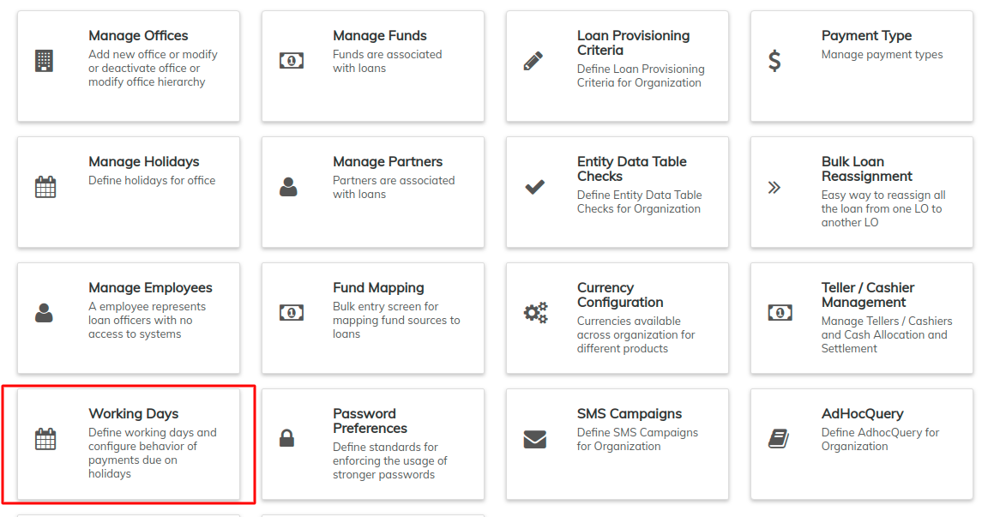

# Working Days

Beginning at the main screen, select **Admin,** then **Organization** from the drop down menu. This will launch the [**Organization**](./) **** menu.

Select **Working Days** to specify working days.

This will launch the Working Days page with days pre-selected.

You now are able to do the following;

1. You can un-check the working days that do not apply in your organization and check those that do by clicking on the box besides the day of the week. Checking the box means the day is a working day while un-checking means the day is a non-working day.
2. Select the day in which payments due on non-working days will apply by clicking the drop-down menu.

&#x20; The existing options are:&#x20;

* &#x20;"Same day":- For example: If Sunday is a Non-working day, the payments falling on Sunday will be on Sunday (on the same day).
* &#x20;"Move to next working day":- For example: If Sunday is a Non-working day, the payments falling on Sunday will be moved to Monday which is the next working day.
* &#x20;"Move to next repayment meeting day":- For example: If Sunday is a Non-working day, the payments falling on Sunday will be moved to next Friday which is a next repayment meeting day.
* &#x20;"Move to previous working day":- For example: Sunday is a Non-working day so the payments falling on Sunday will be moved to Saturday which is the previous working day.

&#x20;     3\. Decide whether to extend the term for loans following a daily repayment schedule by leaving the box checked or not extended by un-checking the box

When complete, click the **Submit** button.
