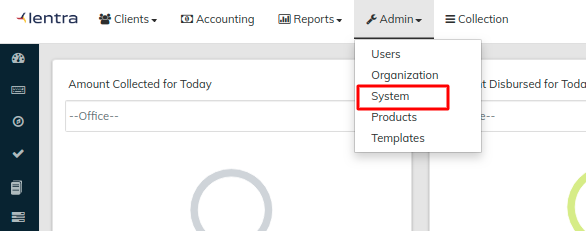
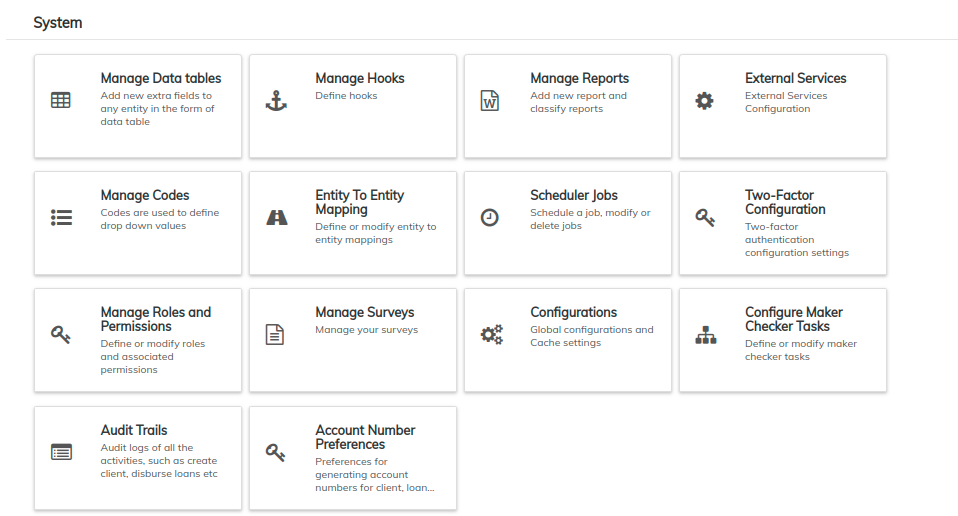

# System

The **System** menu contains links to ten (10) pages. These pages are listed on the right hand side of this page. Each one is designed to help you control the day-to-day operations your organization requires when using LMS.

When getting started with LMS, please refer to the [Initial System Setup](../../initial-system-setup/) page.

Want to learn more about navigation in LMS? See the **General Navigation** section of this manual.

From the Welcome page, click [Administration](../) and choose **System** from the drop down list.

This will launch the System page as shown below;

It is from this page that:

* **Data-tables** are managed and modified
* **Codes** are defined and modified
* **Roles** and **Permissions** are managed
* **Maker Checker** tasks are configured
* **Audit Trails** are managed
* **Reports** are created and modified
* **Jobs** are created, scheduled or modified
* **Global Configurations** are defined
* **Hooks** are defined.
* **Account Number Preferences** are defined.
* **Two-Factor Configurations** are modified.
* **Surveys** are created and managed.
* **Mappings** between entities are defined and modified
* **External Services** are configured
