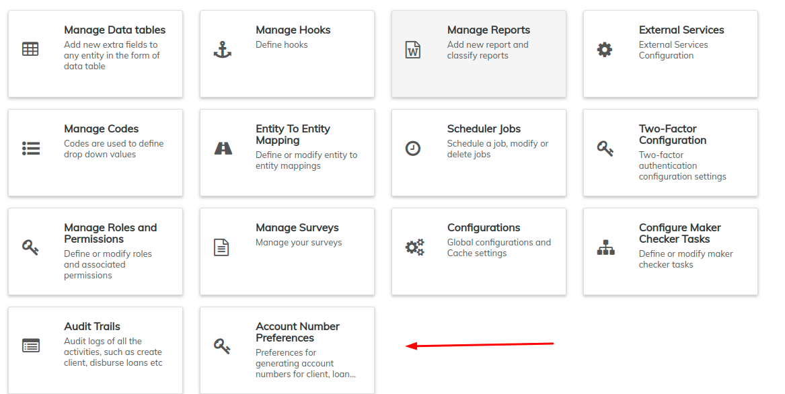
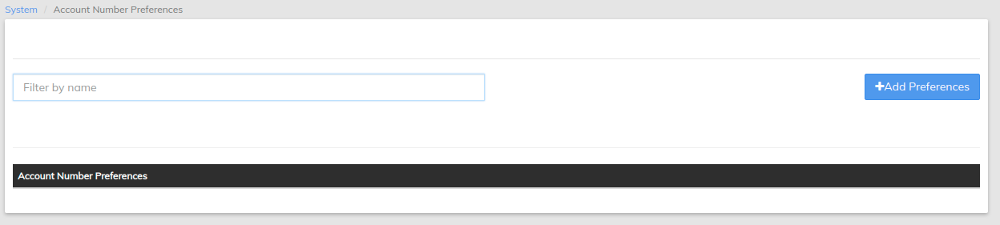
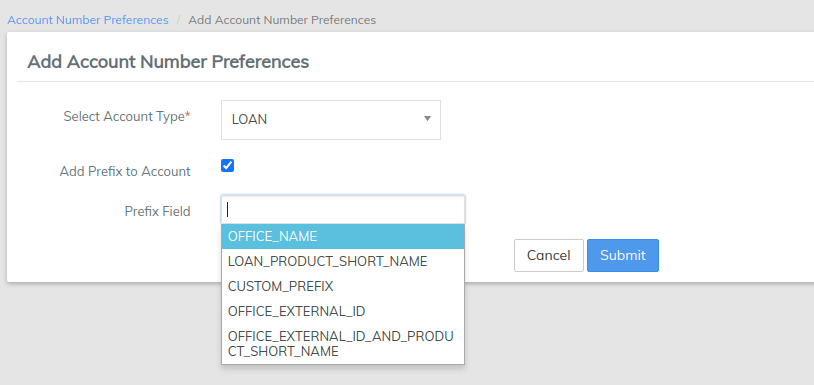

# Account Number Preferences

Account number preferences are used to describe custom formats for account numbers associated with Client, Loan accounts. This enables an organization to easily categorize or differentiate just by account number with respect to the prefixed Office name, Type or by product short name respectively.&#x20;

#### **Step 1:**  

Beginning at the main screen, select **Admin**, then **System** from the drop-down menu. This will launch the [**System**](./) menu.

Select **Account Number Preferences**.

This will launch the Account Number Preferences page as shown below:

#### **Step 2:** 

To start adding preferences, Click on  &#x20;

### **Creating Preferences for Loan Account Number**

* [ ] For **Loan** (Select Account Type)
* [ ] Prefix can be added for: Product Short Name / **Office Name / Custom Prefix / Office external ID / Office external id and product short name** (Select Prefix Field)&#x20;
* [ ] Click on **submit**.

### **Creating Preferences for Client Account Number**

* [ ] For **Client** (Select Account Type)
* [ ] Prefix can be added for:  **Office Name / Custom Prefix / Client Type** (Select Prefix Field)&#x20;
* [ ] Click on **submit**.


CLIENT\_TYPE: the dropdown can be created by going to manage codes



One can only configure one prefix for each account type with respect to the Client, Loan & Savings&#x20;

