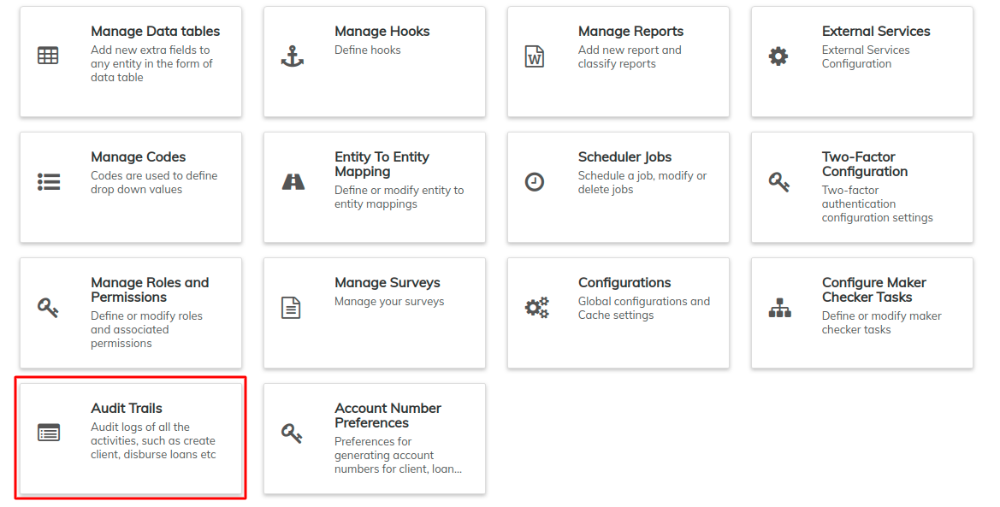
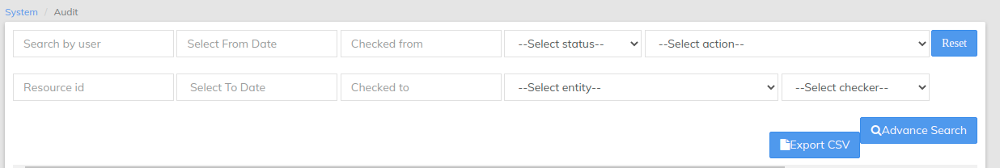

# Audit Trails

&#x20;By selecting different criteria or searching by user, you can gain a better understanding of how your organization is using the LMS platform.

From the Dashboard page, select **Admin**, then **System** from the drop-down menu. This will launch the [**System**](./) menu.

Select **Audit Trails**.

This will launch the Audit Trails page as seen in the screenshot below:

## **Advanced Search for a User**

You can search for a user via the "Search by User" field at the top or you can have an advanced search by clicking the  button at the side of the search bar.

This will activate additional search filters to ease your search;

* Search by user
* Resource ID
* From Date
* To Date
* Checked from&#x20;
* Checked to
* Select status - drop-down menu
* Select Entity - drop-down menu
* Select Action - drop-down menu
* Select checker - drop-down menu

After adding the filters of your choice, click the **Advanced** **Search** button as indicated in the screenshot above LMS will display records according to the filters selected. Should you wish to reset your filters, select the **Reset** Button just above the Advanced Search button. This will clear all entries in the filter fields.

## **How to view an Audit Entry**

On the Audit Trails page, select the the Audit Entry you would like to view (_it will be highlighted in blue when the cursor is over it_.)

A page detailing the Audit Entry will be displayed as seen in the example below:

## **How to Export CSV**

At the top-right of the report is a blue button labelled **Export CSV**. A CSV (or Comma-separated values) is a type of file that stores tabular data in plain text form. This allows the data to be easily transferred between programs that are not normally compatible.&#x20;

To create a CSV file of your selected data, click on the blue **Export CSV** button. This will download a CSV file:

Open the CSV file with an appropriate program of your choice, for example Microsoft Excel or Libre Office Calc. Only the Audit Entries of that page will be exported.

