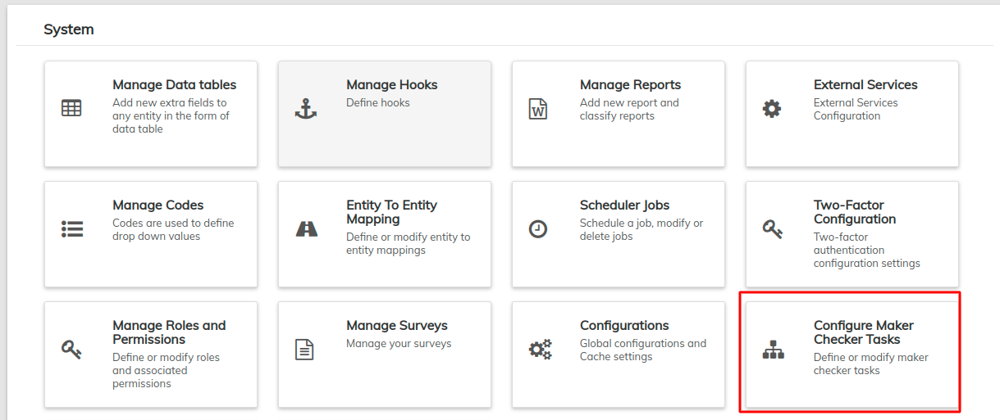

# Configure Maker-Checker Tasks

The “Maker-Checker” principle requires every tasks to be completed by two people to reduce the chance of errors and misuse. One person initiates the process and the second completes it. LMS provides a “best-practice” standard with download. Make changes to it in this section.&#x20;


Please note that Maker Checker may be enabled or disabled using [**Global Configuration**](global-configuration.md)**.**


Beginning at the main screen, select **Admin**, then **System** from the drop-down menu. This will launch the [**System**](./) menu.

Select **Configure Maker-Checker** **Tasks**.

## **Edit Maker-Checker Tasks**

Once you have selected Configure Maker-Checker Tasks, a list of all available Maker-Checker tasks will be generated. The tasks currently enabled for Maker-Checker have a check mark in the box to their right.To add or remove a task from the Maker-Checker list, first click the blue **Edit** button at the top-right of the page. From the page you are able to check or un-check boxes based on what tasks your organization would like to use Maker-Checker for. When everything is correct, click **Submit**.

## **Setup**

### **Maker Checker Inbox**

The Maker-Checker Inbox is found among the shortcuts on the [left navigation menu ](../../../allusers/navigation.md#left-navigation-menu-side-bar)of the the LMS screens and is labeled "Checker Inbox & Tasks."&#x20;

From your Checker inbox you may:

* Approve or Reject the completion of tasks
* Delete tasks

### Enable Maker-Checker Global Configuration

Navigate to the **Configurations** page:

1. Click on **Admin.**
2. Select **System**.
3. Click on the **Configurations** link.

This will launch a list of all Global Configuration options, including whether **Maker-Checker** is enabled or disabled. If it is disabled the chart will read false and the box will be **green** with a small flag inside it - as seen below.

To enable **Maker-Checker** click on the **green box**, when it is enabled the chart will say true and have a **red** box with an 'x' inside it - as seen below.

To learn more about **Configurations** please see the [**Global Configuration**](global-configuration.md) **** section of this manual.
