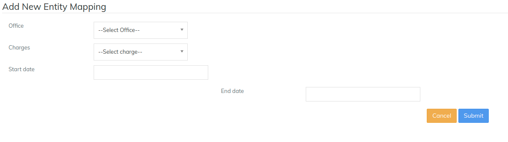
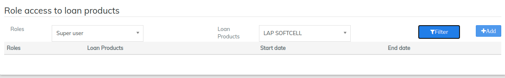

# Entity To Entity Mapping

Now using "Entity to entity mapping", one can restrict accessing the products with respect to Offices or Roles.&#x20;

Beginning at the main screen, select **Admin,** then **System** from the drop down menu. This will launch the [**System**](./) **** menu.

Select **Entity To Entity Mapping** to set the preferences.&#x20;

## Offices --> Loan Products&#x20;

Setting up of Office access to loan products

* [ ] Click on "**Office --> Loan Products**": Office access to loan products page would be displayed
* [ ] Click on "**Filter**": This displays the defined Office access to loan products. Then "Add" would be displayed
* [ ] Click on "**Add**": On clicking the Add button, it will display a page to Add New Entity Mapping as shown below.          &#x20;

Here,&#x20;

1. Need to select Office for which loan products should be accessed
2. Need to select the loan product for which selected office can be accessed
3. This is an optional field, Provided start date will be the effective access date for the mapped products
4. This is an optional field, Provided end date will be the ending date of the provided restricted access.
5. Then click on **Submit.**
6. Now clicking on the Filter>>search button,  you would be able to see added entity mappings.                                     &#x20;

## Offices --> Charges

Setting up of Office access to charges:

* [ ] Click on "**Office --> charges**": Office access to charges page would be displayed.&#x20;
* [ ] Click on "**Filter**": This displays the defined Office access to charges. Then "Add" would be displayed.
* [ ] Click on "**Add**": On clicking the Add button, it will display a page to Add New Entity Mapping as shown below

Here

1. Need to select **Office** for which charges should be accessed
2. Need to select the **charges** for which selected office can be accessed
3. This is an optional field, Provided start date will be the effective access date for the mapped charges
4. This is an optional field, Provided end date will be the ending date of the provided restricted access
5. Then click on **Submit**
6. Now clicking on the Filter>>search button, you would be able to see added entity mappings

## Roles --> Loan products&#x20;

Setting up of Role access to Loan products

* [ ] Click on "**Roles --> Loan products**": Role access to loan products page would be displayed
* [ ] Click on "**Filter**": This displays the defined Role access to loan products. Then "Add" would be displayed
* [ ] Click on "**Add**": On clicking the Add button, it will display a page to Add New Entity Mapping as shown below.

Here,&#x20;

1. Need to select Role for which loan products should be accessed
2. Need to select the loan products for which the selected role can be accessed
3. This is an optional field, Provided start date will be the effective access date for the mapped charges
4. This is an optional field, Provided end date will be the ending date of the provided restricted access
5. Then click on **Submit**

## Editing or Deleting a Created Entity&#x20;

In the page shown in the example below, you can Edit or Delete as mentioned below:&#x20;

1\) Click on the required Entity to entity mapping.&#x20;

2\) Click on Filter button, Created entity mapping would be displayed.&#x20;

3\) To **Edit** - Click on "**Edit"** button, Edit page would be displayed wherein you can make any necessary modification.&#x20;

4\) To **Delete** - Click on "**X**" button, It will ask for the delete confirmation, by clicking on the yes button it gets deleted.&#x20;

Important Note


To enable this feature, you need to go to Admin>>System>>Configuration and enable

* office-specific-products-enable, only then you would be able to restrict office specific products
* restrict-products-to-user-office, only then you would be able to restrict products to users


.

