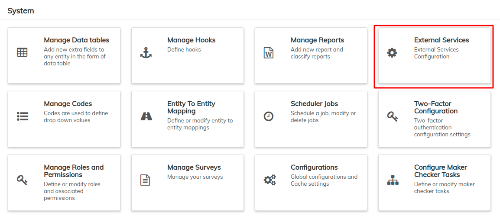
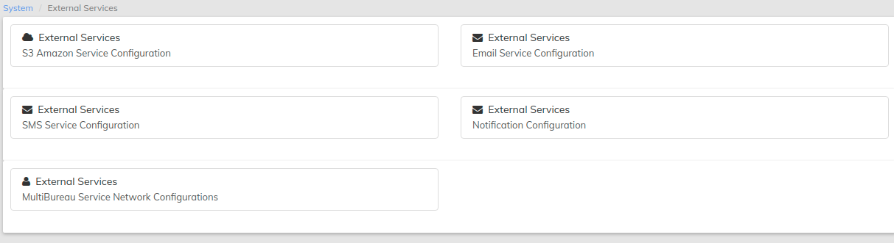
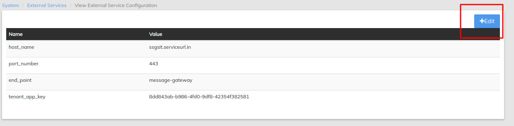
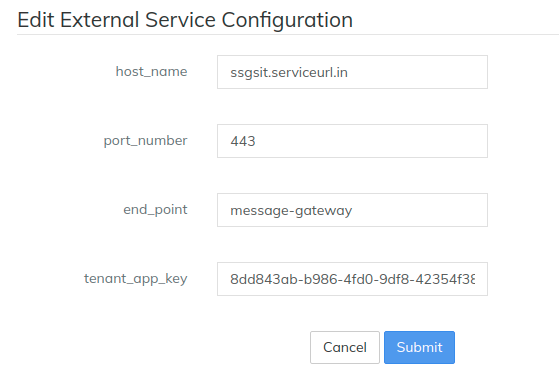

# External Services

External Services Configuration related to set up supported configurations for third party services like SMS and SMTP:

Beginning at the main screen, select **Admin,** then **System** from the drop down menu. This will launch the **System** menu.

## **Configuring Message Gateway in Platform**

At the top the screen, navigate to **Admin** and select **System** from the drop-down.

Select **External Services**

**Step 2:** Next Click **External Services (SMS Service Configuration)**

**Step 3:** Click   button at the top-right of the page

**Step 4:** Set the following parameters in **Edit External Service Configuration**

Edit External Service Configuration

**host\_name:** Use the {**Message-gateway host name**}

**Port\_Number:** It should be **9191**

**end\_point:** Set end point as **message-gateway-0.0.1/**

**tenant\_app\_key:** {Paste the same tenant\_app\_key that is generated while configuring **Message-Gateway**}

**Step 5:** Click **Submit.**\
****

## **Email Service Configuration**&#x20;

Enables configuring Email services. This is interlinked to the User - Auto generate password, whenever the email is provided at user page. It sends the mail using these set configurations. Provide **User name, Password, host, port number & useTLS** details and click on save button.&#x20;

## Configure Multi Bureau Settings

To add
