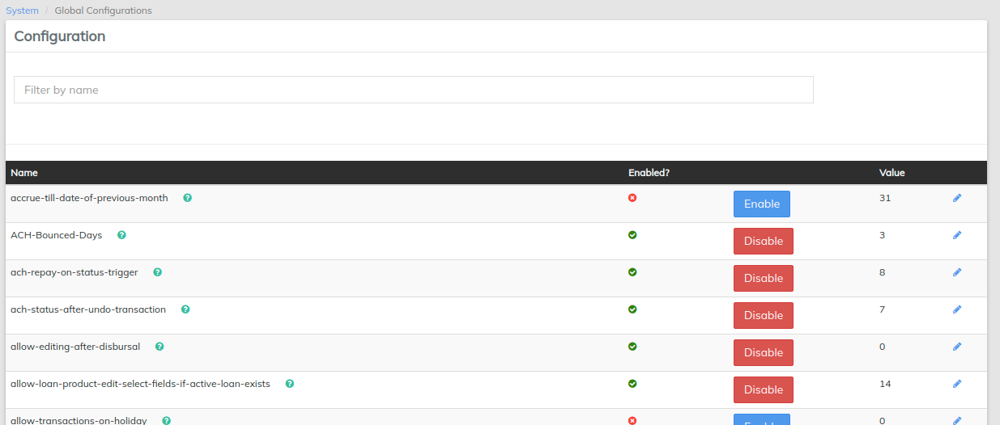
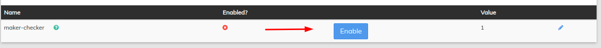

# Global Configuration

From here several global settings are defined. These are typically set up at the initial system installation and are rarely changed. &#x20;

Beginning at the main screen, select **Admin**, then **System** from the drop-down menu. This will launch the [**System**](./) menu.

Select **Configurations**.

Once you have selected configurations, LMS will display all Global Configuration options and their current status in a chart:

## Explanation of each global configuration setting

Some global configurations are simply a Boolean setting, specifying if its true (enabled) or false (disabled). Others are numerical settings in which the value corresponds to a month of the year, number of days, etc. Please read the purpose/description closely to understand.&#x20;

| Name                                                        | Purpose/Description                                                                                                                                                                                                                                                                                                                                                                                                          | Default   | Values |
| ----------------------------------------------------------- | ---------------------------------------------------------------------------------------------------------------------------------------------------------------------------------------------------------------------------------------------------------------------------------------------------------------------------------------------------------------------------------------------------------------------------- | --------- | ------ |
| Allow transactions on holiday                               | Determines if transactions will be permitted on holidays.                                                                                                                                                                                                                                                                                                                                                                    | Enabled   | 0/1    |
| Allow transactions on non-working day                       | Determines if transactions will be permitted on non-working days such as weekends.                                                                                                                                                                                                                                                                                                                                           | Enabled   | 0/1    |
| Amazon S3                                                   | Determines if file and image uploads will be handled by alternative Amazon S3 cloud storage.                                                                                                                                                                                                                                                                                                                                 | Disabled  | 0/1    |
| Accrue till date of previous month                          | Determines from the previous months date due till date                                                                                                                                                                                                                                                                                                                                                                       | Enabled   | 31     |
| ACH Bounced Days                                            | sets the number of days after which Due ACH will be marked as Bounced                                                                                                                                                                                                                                                                                                                                                        | Enabled   | 1      |
| ACH Repay on ststus Trigger                                 | Determines at which stage the repayment entry will take place                                                                                                                                                                                                                                                                                                                                                                | Disabled  | 11     |
| ACH Status After undo transaction                           | Determines the Status of the EMI After Undo transaction                                                                                                                                                                                                                                                                                                                                                                      | Enabled   | 6      |
| Allow Editing after disbursal                               |  It will allow Editing the loan even after disbursal                                                                                                                                                                                                                                                                                                                                                                         | Enabled   | 0/1    |
| Allow Loan Product Edit select fields if active loan Exists | Determines the loan Product parameters can be edited even if there is active loan presented                                                                                                                                                                                                                                                                                                                                  | Enabled   | 0/1    |
| Allow transaction on holidays                               | Determines If transaction will be permitted on Holidays                                                                                                                                                                                                                                                                                                                                                                      | Disabled  | 0/1    |
| Allow transaction on non- working day                       | Determines If transaction will be permitted on Non - working days such as weekends                                                                                                                                                                                                                                                                                                                                           | Disabled  | 0/1    |
| Backdate-penalties-enabled                                  | Determines whether backdated penalties are applied                                                                                                                                                                                                                                                                                                                                                                           | Enabled   | 0/1    |
| Change-EMI-if-repayment date-same-as-disbursement date      | Helps in changing EMI if repayment date is same as that of disbursement date                                                                                                                                                                                                                                                                                                                                                 | Enabled   | 0/1    |
| Cheque Bounce day                                           | Sets the number of days after which due PDC will be marked as Bounced                                                                                                                                                                                                                                                                                                                                                        | Enabled   | 1      |
| Constraint approach for data tables                         | Determines whether the Code Value Name or the Code Value ID will be stored in the generated data table. If disabled, the Code Value Name will be stored in the generated data table. If enabled, the Code Value ID will be stored in the generated data table.                                                                                                                                                               | Disabled  | 0/1    |
| Cooling period between multiple notice                      |  Sets the minimum number of days between  two subsequent legal notice                                                                                                                                                                                                                                                                                                                                                        | Enable    | 4      |
| daily-tpt-limit                                             | Enabling this it will limit third party transfer to mentioned amount. Used mainly for self service user.                                                                                                                                                                                                                                                                                                                     | Disabled  |        |
| Days before due to present PDC                              | Sets the number of days before PDC's due date when the Scheduler will mark a PDC as "Presented" For Example, if set to '2', PDC's will be marked as Presented 2 days before their due date                                                                                                                                                                                                                                   | Enabled   | 2      |
| Demand generation for Collection                            | Shows due amount in the collection modules(PDC MOdule and ACH/ECH Modules) Depending on the Value entered. Allowed values - '0' = instrument amount(shows the total amount for each instrument such as PDC or ACH/ECH, etc). '1' = Total Installment AMount(shows the total installment amount scheduled for each repayment period). '2' = Outstanding Installment amount(shows the amount outstanding for each installment) | Enabled   | 2      |
| DPD Day to enable legal model                               | Sets the no of DPD's after which the legal module can be activated                                                                                                                                                                                                                                                                                                                                                           | Enabled   | 30     |
| Enable-Address                                              | Helps in adding address field at the time of client creation.                                                                                                                                                                                                                                                                                                                                                                | Disabled  | 0/1    |
| Enable cash accounting if loan NPA                          | Determines that if the Loan account is NPA then cash accounting can be activated                                                                                                                                                                                                                                                                                                                                             | Disabled  | 0/1    |
| Financial Year Beginning Month                              | This should be set at the database level before any savings interest is posted. Allowed values 1 - 12 (January - December). Interest posting periods are evaluated based on this configuration.                                                                                                                                                                                                                              | Enabled   | 1 - 12 |
| Force password reset days                                   | Determines if passwords expire and whether or not users will be required to reset their passwords after a certain number of days. Allowed values are 0 - 30. Values of 0 means they are not enabled and passwords will not expire.                                                                                                                                                                                           | Disabled  | 0 - 30 |
| Grace on penalty posting                                    | Determines whether Moratorium functionality is permitted. If enabled, Moratorium functionality is allowed; if disabled, Moratorium functionality is not allow.                                                                                                                                                                                                                                                               | Enabled   | 0/1    |
| Interest Charged for Both days                              | Determines Interest can be charged for both days                                                                                                                                                                                                                                                                                                                                                                             | Disabled  | 0/1    |
| Interest-charged-from-date-same-as-disbursal-date           | By enabling it, interest will be charged from the same date of disbursement date                                                                                                                                                                                                                                                                                                                                             | Disabled  | 0/1    |
| Is cache enabled                                            | Determines if caching is enabled in the platform to improve performance.                                                                                                                                                                                                                                                                                                                                                     | Disabled  | 0/1    |
| Is last name required                                       | Determines if the last name is required or not                                                                                                                                                                                                                                                                                                                                                                               | Enabled   | 0/1    |
| Maker-checker                                               | Determines if the maker-checker system will be used.                                                                                                                                                                                                                                                                                                                                                                         | Disabled  | 0/1    |
| max-clients-in-group                                        | Determines the maximum number of clients that can be added to the group.                                                                                                                                                                                                                                                                                                                                                     | Disabled  |        |
| meetings-mandatory-for-jlg-loans                            | Enabling this makes meetings mandatory for JLG loans                                                                                                                                                                                                                                                                                                                                                                         | Disabled  | 0/1    |
| min-clients-in-group                                        | Determines the minimum number of clients that can be added to the group.                                                                                                                                                                                                                                                                                                                                                     | Disabled  |        |
| office-opening-balances-Contra-account                      | Enabling this helps in setting up opening GL balances for a given organisation.                                                                                                                                                                                                                                                                                                                                              | Disabled  | 0/1    |
| office-specific-products-enabled                            | Helps in enabling entity to entity mapping for a given organisation                                                                                                                                                                                                                                                                                                                                                          | Disabled  | 0/1    |
| Organization start Date                                     | On enabling and providing organization start date, all the calculations will effect from this date. It's recommended to enable this entity if you want to use accounting module. You could set the start date from the database under table "c\_configuration" and provide start date under date value row.                                                                                                                  | Disabled  | 0/1    |
| Park Excess payment in separate GL                          | Determines whether or not the excess payment will get parked in different GL Note: Once Enabled you can not Disabled the configuration                                                                                                                                                                                                                                                                                       | Enabled   | 0/1    |
| payment-type-applicable-for-disbursement-charges            | Helps in enabling payment types for charges.                                                                                                                                                                                                                                                                                                                                                                                 | Disabled  | 0/1    |
| Penalty wait period                                         | Defined in terms of days. Defines how many days overdue before an overdue penalty will be charged.                                                                                                                                                                                                                                                                                                                           | Enabled   | 0-30   |
| Registered all ACH if one registered for loan               | Determines that if one ACH is registered for loan then can registered all as ACH for the loan                                                                                                                                                                                                                                                                                                                                | Enabled   | 0/1    |
| Reschedule future repayments                                | If enabled, reschedules repayments which fall on a non-working day to configured repayment [rescheduling rule](https://demo.openmf.org/api-docs/apiLive.htm#nw\_repayment\_schedule\_rule).                                                                                                                                                                                                                                  | Disabled  | 0/1    |
| Reschedule repayments on holidays                           | Determines if repayments that occur on holidays will be rescheduled.                                                                                                                                                                                                                                                                                                                                                         | Enabled   | 0/1    |
| restrict-products-to-user-office                            | Helps in restricting products for users in a given office                                                                                                                                                                                                                                                                                                                                                                    | Disabled  | 0/1    |
| rounding-mode                                               | 
Enabling this rounding of amount is performed. Values that can be given are:

0 - UP 1 - DOWN 2 - CEILING 3 - FLOOR 4 - HALF_UP 5 - HALF_DOWN 6 - HALF_EVEN
                                                                                                                                                                                                                                    | Enabled   | 0-6    |
| Savings Interest Posting Current Period End                 | Recommended to be changed only once during the start of production. When set as false (default), interest will be posted on the first date of the next period. If set as true, interest will be posted on last date of current period. There is no difference in the interest amount posted.                                                                                                                                 | Disabled  | 0/1    |
| Set overdue since date on principal interest                | Sets no of days overdue since the date on principal interest                                                                                                                                                                                                                                                                                                                                                                 | Enabled   | 0/1    |
| skip-repayment-on-first-day-of-month                        | Enabling this skips the repayment date if the repayment is scheduled on the first day of the month                                                                                                                                                                                                                                                                                                                           | Disabled  | 0-31   |
| Time frame between two legal actions                        | Specifies the time(In days)between one legal notice and next legal notice                                                                                                                                                                                                                                                                                                                                                    | Enabled   | 5      |
| Update ACH on tranche disbursal                             | Determines whether the NACH amount will get updated after tranche disbursal or not                                                                                                                                                                                                                                                                                                                                           | Enabled   | 0/1    |
| Use manage code configuration for ACH and PDC               | Determines whether the manage code can be configured for ACH and PDC or not                                                                                                                                                                                                                                                                                                                                                  | Enabled   | 0/1    |
| View Full Repayment Schedule                                | When disabled only repayments up to current date can be viewed in the repayment tab                                                                                                                                                                                                                                                                                                                                          | Enabled   | 0/1    |
| View Transaction Tab                                        | When Disabled The Transaction tab will be hidden                                                                                                                                                                                                                                                                                                                                                                             | Enabled   | 0/1    |

## Value table For ACH

| **Status**       | Value |
| ---------------- | ----- |
| Not Registered   | 6     |
| Registered       | 7     |
| Demand generated | 8     |
| Cleared          | 9     |
| failed           | 10    |
| Bounced          | 11    |
| Swapped          | 12    |

## value table For PDC

| Status           | value |
| ---------------- | ----- |
| Received         | 0     |
| Presented        | 1     |
| Bounced          | 2     |
| Represented      | 3     |
| Cleared          | 4     |
| Returned         | 5     |
| Swapped          | 6     |
| Do\_Not\_Present | 7     |
| Failed           | 8     |

## Values For Security and Generic Cheque

| Status             | value |
| ------------------ | ----- |
| Received           | 0     |
| Presented          | 1     |
| Bounced            | 2     |
| Represented        | 3     |
| Cleared            | 4     |
| Returned           | 5     |
| Swapped            | 6     |
| Converted\_To\_PDC | 7     |

## value Table For Cash

| Status   | value |
| -------- | ----- |
| Received | 1     |
| Swapped  | 2     |

## Enable or Disable a Global Configuration Setting

Once you have navigated to the **Configurations** page, you can easily enable or disable your organization's Global Configuration settings. When a setting is **Enabled** it will have "True" in the **Enabled?** column.&#x20;

To disable a setting click on the **Red Square** with a **'Disable'** on it. The setting will be disabled.

When a setting is **Disabled** it will have "False" in the **Enabled?** column.&#x20;

To enable a setting click on the **Blue Square** with a **Enable** written on it. The setting will be enabled.


There is no Submit or Save for this screen. When satisfied with the settings, you may navigate to another page.


