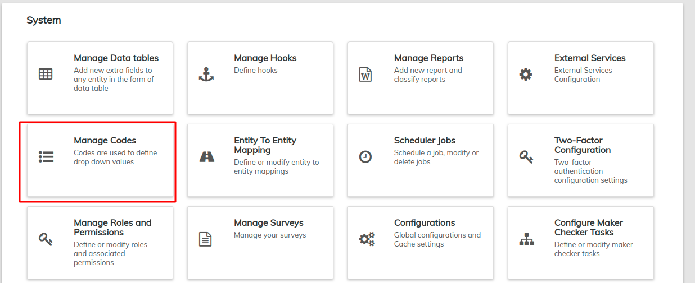
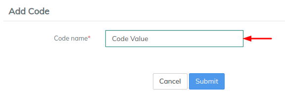
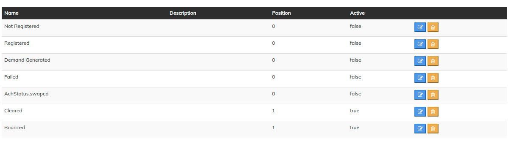

# Manage Codes

Codes or drop-down values are  instrumental parts of the LMS. From this selection you can create new drop-downs and edit their values as well as edit the values for system-generated codes and drop-downs.&#x20;

Navigate to **Admin >> System,** and click on **Manage Codes**

## **View Codes**

Once you click on **Manage Codes,**  application will generate a list of all codes in the LMS system for your organization.

One can search the required field by using the **Filter by Name** search bar at the top of the list.

* LMS provides a list of standard system codes.
* Can be customized to terms used by your organization.
* Information provided here will appear in the drop-down menus in the system.
* Adjust the numbers to reflect the desired order for the menu.

## How to Add Code?

#### **Add Code** 

You may create additional codes in this area by following the steps:

1. Click on **Add Code **_****_ button at the top-right of the screen\
   \
   

&#x20;      2.Type the code name in the blank field

&#x20;          **3. CLICK**&#x20;

#### Customize Code Values 

The system comes with the most commonly used codes. To add specific fields for your organization,

1. Click on the desired code.
2. Click on 
3. Type in the Name to appear in the field's drop down menu.\
   
4. Enter the position of each code value for a given field.  In this example, the "Client Closure Reason" lists four reasons a client may leave the organization.\
   
5. When working on a client account, the "Client Closure Reason" lists four reasons a client may leave the organization. \
   \
   
6. The above created code values appear in the system drop downs.\
   

#### System-defined Codes  

| Code Name                             | Description                                                                                                                                            |
| ------------------------------------- | ------------------------------------------------------------------------------------------------------------------------------------------------------ |
| ACH payment Trigger                   | IF Active= true then If loan account bounced or failed then repayment will be made                                                                     |
| ACH Status For collection sheet       | This will appear in Collection tab under individual collection sheet                                                                                   |
| Address\_type                         | This will appear in client screen, the address type may include permanent address, residential address, office address.                                |
| Asset Account Tags                    | Asset account tags include cash, cash in bank, inventory and so on. The accounting staff will identify the required tags in pre-configuration planning |
| Asset Type                            |                                                                                                                                                        |
| Bank name                             | Specifies the bank name                                                                                                                                |
| BIll-DIscounting                      | This will appear in Product creation for Loan to value interest calculations                                                                           |
| BRMapping                             |                                                                                                                                                        |
| C enter Closure Reason                | Lists the reason to close the center, this information appears in center screen.                                                                       |
| Client Classification                 | This will appear on the Create Client screen. The organization may add descriptors to define customer classes for reporting requirements.              |
| Client Closure Reason                 | List any reasons a customer may close an account. This information will appear on the Client Close screen.                                             |
| Client Limit name                     | This will appear on client screen under Limit management screen                                                                                        |
| Client Limit Type                     | This will appear on the Create Client screen where it will asks for client limit type they are revolving and Non-revolving                             |
| Client Type                           | This will appear on the Create Client screen. The organization may add descriptors to define customer classes for tracking and reporting purposes.     |
| Code value                            |                                                                                                                                                        |
| Collateral level                      | This will appear if loan product is secured then it will be there in loan creation                                                                     |
| Company name                          |  This appear in Client creation                                                                                                                        |
| Company Address                       | This will use in SOA TAB under any loan                                                                                                                |
| Company Address for SOA               | This will appear in SOA tab under loan screen                                                                                                          |
| Client reject reason                  | Lists the reason with respect to client rejection criteria, this will appear in client reject screen.                                                  |
| Client sub status                     | Lists the reason which shows sub status of a client.                                                                                                   |
| Client withdraw reason                | Lists the reason with respect to client withdraw, this will appear in client withdraw screen.                                                          |
| Constitution                          | Shows the list of districts, this will appear in create client screen.                                                                                 |
| Country                               | Shows the list of countries, this will appear in create client screen.                                                                                 |
| Customer Identifier                   | This will appear on the Create Client screen. The organization will list all acceptable form of identification a customer can use.                     |
| Entity to Entity access type          | This will appear in System tab go to Entity to Entity mapping                                                                                          |
| Equity Account Tags                   | This will appear as a "tag" on the **Accounting/General Ledger** screen when creating or editing an equity account.                                    |
| Expense Account Tags                  | This will appear as a "tag" on the **Accounting/General Ledger** screen when creating or editing an expense account.                                   |
| family Relationship                   | This will appear in Create client screen under Family member if person is selected                                                                     |
| Gender                                | This will appear on the Create Client screen. The system provides male/female                                                                          |
| Group Closure Reason                  | This will appear on the Close Group screen. The organization may list the reasons accepted to close a group.                                           |
| Group Role                            | This will appear in the Group Create and Edit screens. This allows the organization to define roles such as "leader" or "trainer."                     |
| Guarantor Relationship                | This will appear in the New Loan screen. The organization will list the acceptable loan guarantors.                                                    |
| Income Account Tags                   | This will appear as a "tag" on the **Accounting/General Ledger** screen when creating or editing an income account.                                    |
| Liability Account Tags                | This will appear as a "tag" on the **Accounting/General Ledger** screen when creating or editing a liability account.                                  |
| Loan account Relationship             |                                                                                                                                                        |
| Loan account Relationship with Entity |                                                                                                                                                        |
| Loan Collateral                       | This will appear in the New Loan screen. The organization will list the acceptable loan collateral.                                                    |
| Loan Purpose                          | This will appear in the New Loan screen. The organization will list the acceptable loan purposes.                                                      |
| Loan reschedule reason                | Lists the reason for rescheduling the loan, it may include values like "repay after two months", "Change the repayment date" .                         |
| Main Business Line                    | Lists the different business streams of the customer, this will appear in create client screen.                                                        |
| Marital Status                        | This will appear in Create client under family member option                                                                                           |
| Overdue Classification                | This will appear in Collection tab under staff allocation of loan this option will be there                                                            |
| Over utilisation charge on            |                                                                                                                                                        |
| PDC Repayment Trigger                 |  IF Active= true then If loan account bounced or failed then repayment will be made                                                                    |
| PDC Status for Collection sheet       | This will appear in Collection tab under individual collection sheet                                                                                   |
| Profession                            | This will appear in create client screen under Family members if legal form is selected as person                                                      |
| Security cheque usage option          | This will appear under Loan level within security cheque tab                                                                                           |
| SMS Provider                          | This will appear in Oraganization under SMS campaign create SMS campaign                                                                               |
| STD Code                              |                                                                                                                                                        |
| Relationship Type                     | This will appear in the New Client screen. The organization will list the relationships used in the organization such as "spouse."                     |
| State                                 | Shows the list of states, this will appear in create client screen.                                                                                    |
| Write Off Reasons                     | Lists the reason for closing the loans.                                                                                                                |
| Yes or No                             |                                                                                                                                                        |


For create customer dropdown fields use Data tables and Manage code together.&#x20;

