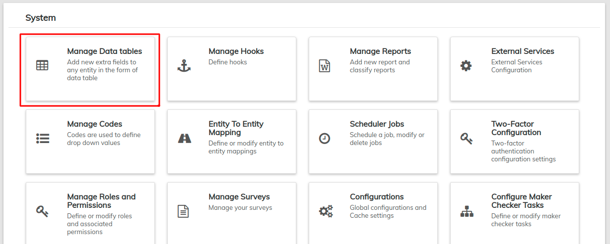
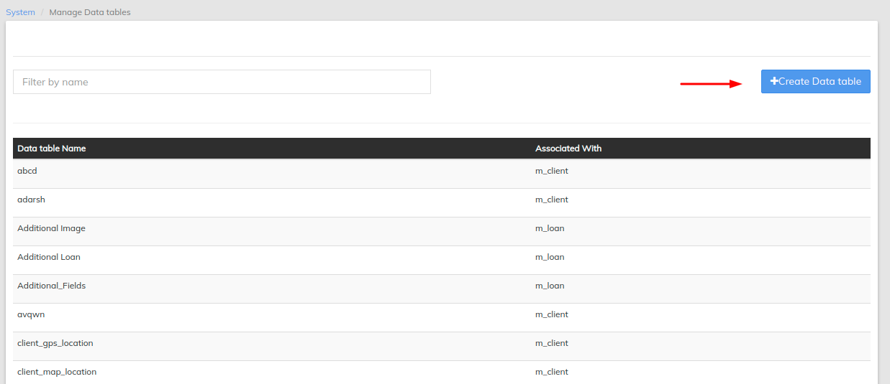
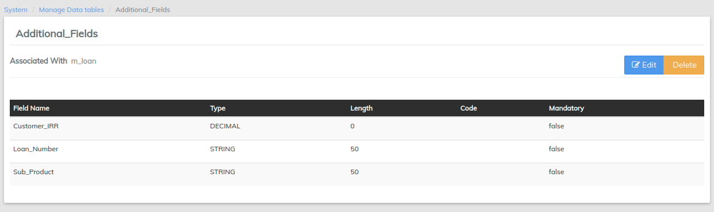

# Manage Data Tables

LMS data-tables allow the user to add custom fields in addition to the built-in fields to a client profile, loan/saving account, group, center or an office.

For example, you may want to collect additional client details such as education and poverty level. You can do this in LMS by creating a data-table, choosing the client application table name and adding custom fields: education and poverty level.

In another example, you may want to collect additional loan details, such as business name, business type, monthly cash flows, and outstanding liabilities. You can do this in LMS by creating a business details data-table, choosing the loan application table name and adding custom fields such as business name, business type, monthly cash flows, and outstanding liabilities.

When creating a set of custom fields (i.e., data-table), you can set the multi-row option to capture multiple instance of data. It should be noted that custom field supports 6 data types (String , Number, Decimal, Date, Text and Drop-down)

Beginning at the main screen, select **Admin >> System** from the drop-down menu. This will launch the [**System**](./) menu.

Select **Manage Data Tables**.

## **View Data Tables**

Once you have have selected **Manage Data Tables,** LMS will generate a list of all currently available data tables. This will appear in alphabetical order but you may filter the results by using the **Filter by Name** field at the top of the list. To view a data-table in detail, click on its name in the list - it will be highlighted blue when the cursor is hovering over it.&#x20;

Once selected, another page will be displayed showing all the details of that Data Table. From there, you can choose to edit or delete it.

## **Create a New Data Table**

Once you have navigated to the **Manage Data Tables** screen, you may create a new data table. Click the blue **Create Data Table** button at the top-right of the screen to add a new data table.

This will launch a page that will allow you to create a new data table as shown below;

* Give the Data Table an appropriate name of your choice.
* The **Application table name** field will provide a drop down of system functions the data table will affect. For example, if you are adding fields that will impact the Client level, click on **Client.**
* Select Multi row if there will be more than one entry.
* Under Add Columns, enter an appropriate name of your choice for the field in the **Column name** box. Then select a column type from the **column type** drop-down menu. Some options include Date, Number, String, Decimal. Click the plus (**+**) button to add your custom field.&#x20;

To add more columns, repeat the add columns process until you have entered all the columns you planned for.

From the screenshot above, you can make a field required by clicking the **Mandatory** checkbox next to the type. If you selected a **String** column type for any field**,** enter a maximum number of characters for the field in the **Length box.** For **Drop-down** column type, select a system defined code from the drop-down list. To define your own code, check out the [**Manage Codes**](manage-codes.md) documentation. To delete a field click the blue button at the end of the column.

Check your inputs and then click the **Submit** button.

Here is a table that details the column types:

| Type                                      | Usage                                                                             | Example values                                                                                |
| ----------------------------------------- | --------------------------------------------------------------------------------- | --------------------------------------------------------------------------------------------- |
| String                                    | To capture names, address line, email-id                                          | Stev, Nayan, 17th Cross,                                                                      |
| Number                                    | To capture age, number of children, number of earning members                     | Ex: Age = 23                                                                                  |
| Decimal                                   | To capture income, monthly expense, interest rate, growth rate                    | 100.50, 1200.5, 10.25                                                                         |
| Date                                      | To capture date of birth, joining date                                            | 21-Jan-1983, 17-Jan-2013                                                                      |
| Text                                      | To capture person's description or business description                           | "I started this business 3 years ago with my savings and now I am looking for loan to expand" |
| Drop-down                                 | To capture relationship, qualification, employment type or any pre-defined values | \[Father, Mother, Sister, Brother] , \[Self employed, Govt employee]                          |

## **How to Modify a Data Table**

Once you have selected a data table from the **Manage Data Tables** page you may modify it. Click the blue **Edit** button at the top-right of the screen to modify the table.

This will launch a page that will permit you to modify the information of the Data Table as shown below:

Once you have modified the necessary information, click On the blue **Submit** button below the page to update the Data Table.

## **How to Delete a Data Table**

Once you have opened a data table page, you may delete it. To delete a data table:

* Click on the data table name in the list of available tables at the **View Data Tables** screen.
* Click on the orange **Delete** button at the top-right of the screen&#x20;

This will launch a pop-up window to confirm the deletion as seen in the screenshot below;

Click the blue **Confirm** button to delete the data table.
