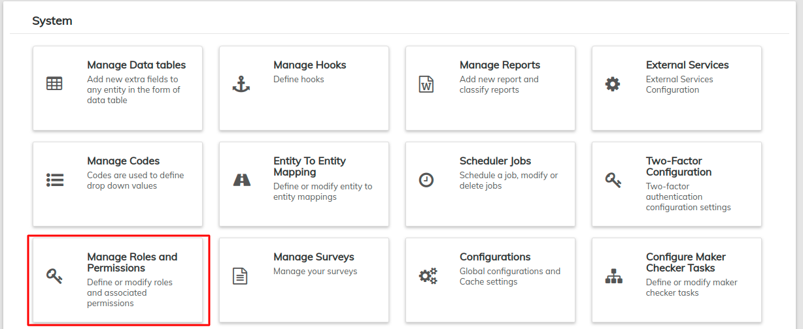
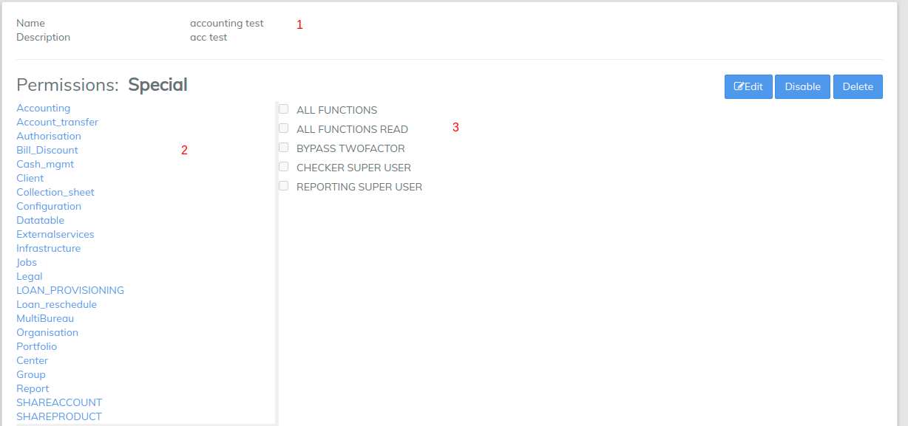
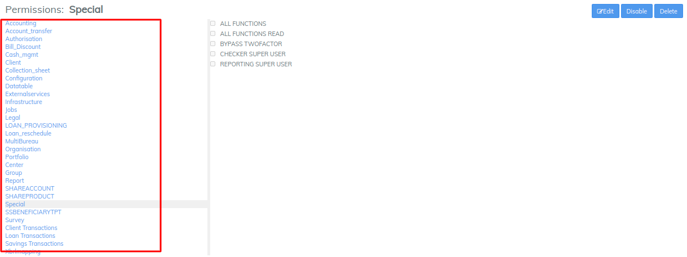
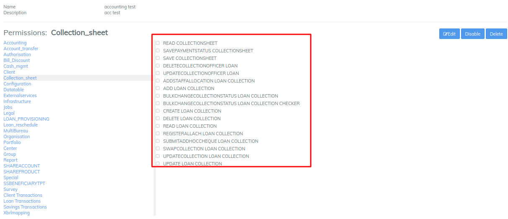

# Manage Roles and Permissions

Roles and Permissions allow the administrator to control access to LMS based on what roles are assigned to **Users** and what **Permissions** are assigned to roles. The **Roles and Permissions** page is the place to customize roles and select permissions.

#### What are Roles and **Permissions?** 

**Roles:** Roles are assigned to users. A user's role will determine what functions a user is allowed to perform within the system. A user may have more than one role assigned to him, thus giving him access to different functions.

**Permissions:** Permissions are assigned to roles. These determine what functions are assigned to a role - which in turn determine what tasks a user is able to complete within the system.

#### **How to navigate?** 

Navigate through  **Admin>> System>>** click on **Manage Roles and Permissions**&#x20;

## View Roles

Once you have navigated to **Manage Roles and Permissions,** you will see a list of roles defined within the organization. One can **click** on these roles and view the permissions that are defined in each role and can even **edit** or **delete** the role if he has super user privileges.&#x20;

## View Permissions

On selecting the appropriate role, you will be navigated to a page where details of the role are defined. Additionally all current permissions associated with this role can be seen - they are marked with a check mark to the right of each permission.

#### **How to assign Roles and Permission?** 

To assign roles and permission navigate to **Admin>> System>>** click on **Manage Roles and Permissions>>Add Role**

### Create a new role

To create a new role, click on **Add Role** button at the top right of the screen as shown in screenshot below:&#x20;

This will pop-up a new window to create new role:

1. **Name** the role.
2. Give the role a **description.**
3. Click **Submit.**

&#x20;   Now you will be navigated to **View Permissions** page for the new role. Next **Add Permissions** assigned to a **Role.**&#x20;

### Add Permissions to a role

If a new role has been created or permissions for an existing role require changes, you may edit a role's permissions. When you create a new role you will be automatically taken to the permissions page for that role.

If you would like to edit an existing role, navigate to the **View Roles** screen and select the role you would like to edit. In both cases, you will be taken to the permissions page for that role. Click the blue **Edit** button at the top-right to change the permissions for the role:

The screen will look like below screenshot

Once everything is correct, click **Submit**.

#### How to Configure Different Permission? 

1. LMS provides a feature for configuring multiple types of permission for a given role under different criteria. In the image below, you can see different sets of permissions that can be given to a role.

&#x20;      2\. Lets say if I want to provide certain permissions on **Accounting, I** click on it then a set of permissions under accounting are displayed on the right side of the permissions list. Select different permissions that are required for that particular role.

&#x20;      3\. Next if you want to provide permissions under **Cash Management,** click on **Cash\_mgmt** then select the required permissions under it.

&#x20;      4.Similarly you can configure for the rest of the permissions based upon your requirements.

&#x20;      5\. Click 


Please go through the section and permission details by downloading this excel file.&#x20;



Permission Details

