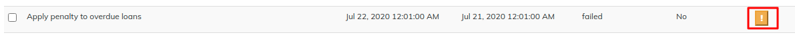

# Manage Scheduler Jobs

By using Scheduler Jobs, you can set batch jobs to be completed at regular intervals. From this page you can schedule, modify or delete jobs. You may also manually run selected jobs by accessing the list of Scheduler Jobs.

Beginning at the main screen, select **Admin**, then **System** from the drop-down menu. This will launch the [**System**](./) menu.

Select **Scheduler Jobs**.

## View Scheduler Jobs

Once you have navigated to the **Scheduler Jobs** page, LMS will generate a list of all scheduled batch jobs. You may select a job from the list by clicking on it in the list, it will be highlighted in blue when the cursor is hovering over it.

Once you have opened the job's detail page you may **Edit** the job and/or **View History** for the selected job.

To **Edit** a job click the blue **Edit** button at the top-right of the job description screen.&#x20;

At this screen you may:

* **Change** the job's name
* **Alter** the Cron expression from the selected job
* **Activate** or **Deactivate** the selected job

**Activate** or **deactivate** a job by clicking on the box to the right of "Is job active?"

If there is a check mark in the box - it is active. If not, click on the empty box to activate the selected job.


Link to create cron expression: [Link](http://www.cronmaker.com/?1)


\
Explanation of each Scheduler Job &#x20;
----------------------------------------

| Job Name                                                              | Purpose/Description                                                                                                                                                                                                                                                                                                                                                                                                                                                                                                                                                                                                                                                                                  | Scheduled Frequency for Execution              |
| --------------------------------------------------------------------- | ---------------------------------------------------------------------------------------------------------------------------------------------------------------------------------------------------------------------------------------------------------------------------------------------------------------------------------------------------------------------------------------------------------------------------------------------------------------------------------------------------------------------------------------------------------------------------------------------------------------------------------------------------------------------------------------------------- | ---------------------------------------------- |
| Add Accrual Transactions                                              | All the interest will be accrued till the 'Due date' of the job run and can be viewed under 'Transactions' tab (Uncheck 'Hide Accruals')                                                                                                                                                                                                                                                                                                                                                                                                                                                                                                                                                             | Daily                                          |
| Account servicing charge calculation                                  |                                                                                                                                                                                                                                                                                                                                                                                                                                                                                                                                                                                                                                                                                                      |                                                |
| Add accrual transactions                                              | This will add accruals transaction entry                                                                                                                                                                                                                                                                                                                                                                                                                                                                                                                                                                                                                                                             |                                                |
| Add Accrual Transactions For Loans With Income Posted As Transactions | Similar to 'Add Accrual Transactions', except that Compounded interest will be accrued once this job is ran. In other words, this job should be run if compounded interests have to accrued.                                                                                                                                                                                                                                                                                                                                                                                                                                                                                                         | Daily                                          |
| Add Accruals Till Date Of Previous Month                              | the no of days given in manage code i,e 31st of every month                                                                                                                                                                                                                                                                                                                                                                                                                                                                                                                                                                                                                                          |                                                |
| Add Periodic Accruals at the end of the month                         |                                                                                                                                                                                                                                                                                                                                                                                                                                                                                                                                                                                                                                                                                                      |                                                |
| Add Periodic Accrual Transactions                                     | Similar to 'Add Accrual Transactions' except that all the interest will be accrued till the current date (i.e... Job run date and time)                                                                                                                                                                                                                                                                                                                                                                                                                                                                                                                                                              | Daily                                          |
| Apply Holidays to Loans                                               | If new 'future' holiday is created (say, February 1) and if this job is ran successfully (say on January 15), it should affect all the repayments scheduled on February 1 and must be postponed to the date described by holiday definition. bAdd Periodic Accrual Transactions.                                                                                                                                                                                                                                                                                                                                                                                                                     | Daily                                          |
| Apply penalty to overdue loans                                        |  This job once ran successfully applies penalty to all overdue loans   based on the penalty definition. The penalties could be daily, weekly  or monthly based penalty charge definition.                                                                                                                                                                                                                                                                                                                                                                                                                                                                                                            | Daily                                          |
| Calculate Interest for LOC loans                                      |                                                                                                                                                                                                                                                                                                                                                                                                                                                                                                                                                                                                                                                                                                      |                                                |
| Change ECS status and add charge                                      | This will                                                                                                                                                                                                                                                                                                                                                                                                                                                                                                                                                                                                                                                                                            |                                                |
| Change PDC status and add charge                                      |                                                                                                                                                                                                                                                                                                                                                                                                                                                                                                                                                                                                                                                                                                      |                                                |
| Execute  Email                                                        | This job is run to send  Emails (without reports) with given template email formats.                                                                                                                                                                                                                                                                                                                                                                                                                                                                                                                                                                                                                 | Daily/Weekly/Monthly                           |
| Execute Report Mailing Jobs                                           | This job is run to mail the reports regularly or recurrently to the given mail ids. It has no UI and mail ids and reports are configured in database level.                                                                                                                                                                                                                                                                                                                                                                                                                                                                                                                                          | Daily/Weekly/Monthly                           |
| Execute standing instruction                                          | 
Standing instructions are created in client level whenever - For Example, A Client has one savings account and one loan account and let's say he has loan repayment first of every month and he expects that the repayments of his loan account must be done through deducting from his savings account on the first of every month automatically.

Once this job is ran successfully, standing instruction of all clients for the particular date (i.e .. job run date) will be applied. That is, as given in the example above, if standing instruction is ran on the first of every month, the savings account will be debited and the loan account will be credited with repayment. 
 | Daily                                          |
| Generate Adhoc Client Schedule                                        |                                                                                                                                                                                                                                                                                                                                                                                                                                                                                                                                                                                                                                                                                                      |                                                |
| Generate Loan Loss Provisioning                                       | This job updates provisioning entries (Accounting>Provisioning Entries) with type (Standard, Sub Standard, etc) defined by Loan Provisioning Criteria (Admin>Organization)                                                                                                                                                                                                                                                                                                                                                                                                                                                                                                                           | Frequency will be defined by the organization. |
| Get Delivery Reports from SMS Gateway                                 | This job is run to get delivery reports from SMS gateway in order to check how many SMSs are successfully delivered.                                                                                                                                                                                                                                                                                                                                                                                                                                                                                                                                                                                 | Daily/Manually                                 |
| Make repayment from Excess payment                                    | If a loan account has excess payment made in it and job is run then if there is any repayment is in due then it will take from excess payment                                                                                                                                                                                                                                                                                                                                                                                                                                                                                                                                                        |                                                |
| Recalculate Interest For Loans                                        | 
If loan accounts enabled with Interest Recalculation and if the clients make more repayment, the new interest will be automatically calculated.

On the other hand, if the client makes less repayment or late repayment, this job is run to update the repayment schedule. 
                                                                                                                                                                                                                                                                                                                                                                                                             | Daily                                          |
| Reverse all accrual entries if loan become NPA                        | If loan is NPA then accrual entries will be reversed                                                                                                                                                                                                                                                                                                                                                                                                                                                                                                                                                                                                                                                 |                                                |
| Send Messages to SMS Gateway                                          | This job is run to send SMSs  from platform to 'Message-Gateway' server.                                                                                                                                                                                                                                                                                                                                                                                                                                                                                                                                                                                                                             | Daily/Manually                                 |
| Update Accounting Running Balances                                    | This job once ran successfully, updates all the running balances based on the branch (office) level.                                                                                                                                                                                                                                                                                                                                                                                                                                                                                                                                                                                                 | Monthly                                        |
| Update loans arrears ageing based on EMI Obligation met date          | same as update loans ageing .It will only move if interest and principal are not paid                                                                                                                                                                                                                                                                                                                                                                                                                                                                                                                                                                                                                |                                                |
| Update loan total Excess payment                                      | It will update  total amount of Excess payment according to repayments                                                                                                                                                                                                                                                                                                                                                                                                                                                                                                                                                                                                                               |                                                |
| Update Email Outbound with campaign message                           | This job is run to send all emails from email server to customer mail account.                                                                                                                                                                                                                                                                                                                                                                                                                                                                                                                                                                                                                       | Daily                                          |
| Update Loan Arrears Ageing                                            | 
This job updates all the loan accounts into 'Arrears Stage' based on Arrears definition of the loan accounts. 

The loan accounts could have different arrears ageing based on the definition (It's generally defined in loan product level).
                                                                                                                                                                                                                                                                                                                                                                                                                                            | Daily                                          |
| Update Loan Paid in Advance                                           | The loan paid in advance immediately updates after the transaction in which loan repayment is done prior to scheduled date. This job is no longer required.                                                                                                                                                                                                                                                                                                                                                                                                                                                                                                                                          | -                                              |
| Update Loan Summary                                                   | This job updates loan summary of each loan account of the clients. However this job is no longer required as loan summary is updated instantly after each transaction.                                                                                                                                                                                                                                                                                                                                                                                                                                                                                                                               | -                                              |
| Update non-Performing Assets                                          | This job updates loan accounts to 'NPA' based on NPA definition in the loan product. Generally, first loans move into arrears and arrears ageing exceeds certain limit, they move into NPA based on the definition.                                                                                                                                                                                                                                                                                                                                                                                                                                                                                  | Daily                                          |
| Update SMS Outbound with Campaign Message                             | This job is run to send all messages from 'Message Gateway' server to customer mobile premises.                                                                                                                                                                                                                                                                                                                                                                                                                                                                                                                                                                                                      | Daily                                          |

## Manually run a scheduler job

Scheduler Jobs run automatically based on configuration and cron job, but we can manually run it at current time. Select the scheduler job by checking and scrolling to the bottom and click on .&#x20;

### Check status of scheduler jobs

If you check the 'Current Running' column, if it's saying 'No' then the job is not in running state. It's already run or it's schedule for  next run has not yet happened.  If 'Current Running' column is saying 'Yes', the job is still in running state and we have to wait until it's finished so that we can see it's results.&#x20;

If you get error after running the job, then please click on the image and mail us the error. We will quickly resovle the error

### Suspend a scheduler job

Select the job by checking on it and then click on 'Suspend' button. Generally, this feature is used to suspend a particular job in unwanted scenarios as jobs are generally run automatically.&#x20;
