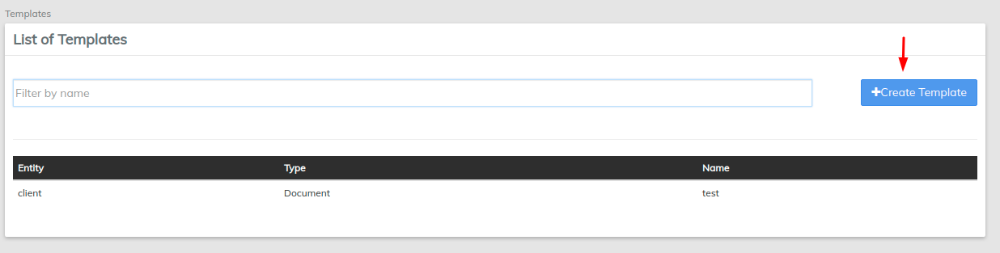
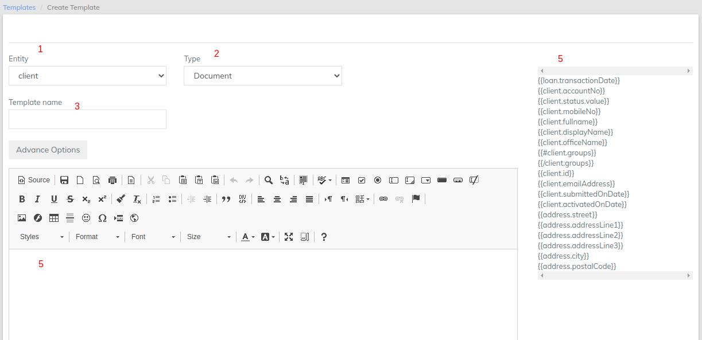

# Templates

Using templates you can generate client-facing document. Template can be created for clients and loans. Example: Client - Client registration documents and Loans - Loan Contracts, Passbooks etc.&#x20;

From the main screen, click on [Administration](./) then select **Templates** from the drop down list.

## Create Template

Click the blue **Create Template** button at the top-right of the screen.

Create Template page

1. Select the **Entity** from the drop-down menu - choose either Client or Loan.\
   Example: Client&#x20;
2. Select the **Type** from the drop-down menu - Document.
3. **Name** the template in the field provided.\
   Example: Client Account number&#x20;
4. Fill in the template **Styles** and **Details** in the space provided.\
   Example: Hello {{`client.displayName`}}, Your account # is {{`client.accountNo`}}.&#x20;
5. In the 4th example showing {{`client.displayName`}}, will be selected from this section.&#x20;
6. Click **Submit** button to create.

## View Templates

By following the **Templates** link, you will be taken to a list of all currently available templates that have been created by your organization.


Use the Filter by Name feature at the top of the screen to save time scrolling. Just begin typing the name you are looking for and LMS will narrow the search.


When the cursor is hovering over a template in the chart it will be highlighted in blue. Click on the template to open its detail page. From there you may **edit** or **delete** your organization's templates.

## Edit/Delete Template

Once you have opened a template's page you may **Edit** or **Delete** it.

To **Delete** it click the orange **Delete** button at the top-right of the screen. This will launch a pop-up window, click the blue **Confirm** button to delete the template.

To **Edit** the chosen template click the blue **Edit** button at the top-right of the screen. This will launch an editing screen for you which you can:

* Change the **Entity**
* **Rename** the template
* Change the **Type** of template
* **Advance Options**

Additionally there is a window with which you can determine the way the template will look. You may alter the applicable **Styles** and the **Format** of the document.

## Advance Templates

Templates can also populate data which is in Array ( List) format. Example of this can be&#x20;

* Repayment Schedules
* Multiple addresses list

To know more about advance templates. Contact us.&#x20;
