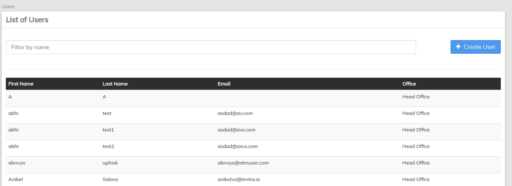

# Users

Application **Users** are people who work for your organization and will be using LMS to track all the information about your organization's operations. For example, an accountant working at a branch needs a user account in this application to track all the accounting related tasks and information. Similarly, a branch manager needs a user account to manage his/her client's portfolios.

In this section, you will learn how to add, delete or modify your organization’s users. These are people with system access working at the offices within your organization. They are subject to different restrictions based on the roles assigned to them (by the system administrator).

Before setting up usernames, the organization should give thought to the standard that will be used throughout the organization. This may be first.lastname; it may be a numerical identifier such as 101lastname (indicating the main office) or 201lastname indicating a branch office.  Whatever the method adopted by your organization, it should be consistently used when creating users.

From the main screen, click on **Admin** then select **Users** from the drop down list.

This will launch the users page that displays a list of Users with their details _(refer to the screenshot below)_ such as:

* First Name
* Last Name
* Email
* Office


Use the **Filter by Name** feature at the top of the screen to avoid scrolling through all the entries. Just begin typing the name you are looking for and LMS will automatically narrow down the search for you.


### **Create a User** 


Before you start to create Users, please ensure that you have created their respective Roles (for more information, see [Manage Roles and Permissions)](system/manage-roles-and-permissions.md).


Start this process by clicking on the blue **Create User** button at the top-right corner of the **Users** screen.

You will then be prompted to fill in a series of fields and define the new user's office and role(s), such as:

* Username
* First Name
* Last Name
* Email
* Office
* Selected Roles

**NOTE: Fields marked with asterisks ('\*') are mandatory.**

* By default, the **Auto generate password** checkbox will be checked. It will send an auto generated password to the provided Email ID.


Auto Generate Password will only work if Email gateway is correctly configured for your tenent


* Alternatively, un-checking the box will allow you to provide a password manually. This will give you access to the **Password** and **Repeat Password** fields that allow you to create your own password.

* Select the associated office of the new user from the drop-down menu:

* Select a role from the **Available Roles** menu to be added to the **Selected Roles**  section by clicking the  button. To add more than one role at once, hold the Ctrl key while clicking on the appropriate roles. Selected roles will be highlighted in blue and then you can forward all of them at once to the Selected Roles section.

* To remove a role from the Selected Roles section, select the role and click the  button.

Once you have filled all the information fields, click the **Submit** button.

### **View User's Profile** 

&#x20;To view a user, click on their **name** on the list and their profile will open. There will be additional information displayed such as:

* Login Name
* First Name
* Last Name
* Email
* Office
* Roles (_assigned to this user_)

Once you open a user's profile, you can perform the following actions:

* Edit user
* Delete user
* Change a password

### **Edit User** 

You may edit the profile of current users within your organization. Follow these steps to do the so:

1. Navigate to the chart of current **Users** - If you are not sure how, please see the **View Application Users** section **** of this manual.
2. Select the user you would like to edit by clicking on their **name** in the chart (this will launch their profile).
3. Click the blue **Edit** button  at the top-right of the page. This will open the user's profile, allowing you to make several changes.&#x20;

Once you have opened the user's profile for editing, you may modify the following fields:

* Username
* First and last name
* Email
* Selecting staff that report to this user by using the drop-down menu marked **Staff**:

* Transfer user account from one office to another office by selecting the office drop-down menu.

After making changes, click **Submit**.

### **Change User Password** 

1. Navigate to the list of current **Users** - If you are not sure how, please see the **View** **Users** section **** of this manual.
2. Select the user whose password you would like to change by clicking on their **name** in the list. This will launch their profile.
3. Click the blue **Change Password** button  at the top-right of the page.
4. This will launch a pop-up window:\
   \
   \
   \

5. Fill in the **Password** and **Repeat password** fields.
6. Click **Submit**.

### **Delete User** 

1. Navigate to the chart of current **Users** - If you are not sure how, please see the **View Application Users** section **** of this manual.
2. Select the user you would like to delete by clicking on their name in the chart. This will launch their profile.
3. Click the blue **Delete** button  at the top-right of the page.
4. Click **Confirm**.

### **Override password expiry policy** 

This option determines whether the password expires or not for this user even if the global configuration for password expiry is enabled.&#x20;

This means that checking this check box will grant you access using the same password, regardless of whether global configuration for password expiry is enabled.&#x20;
