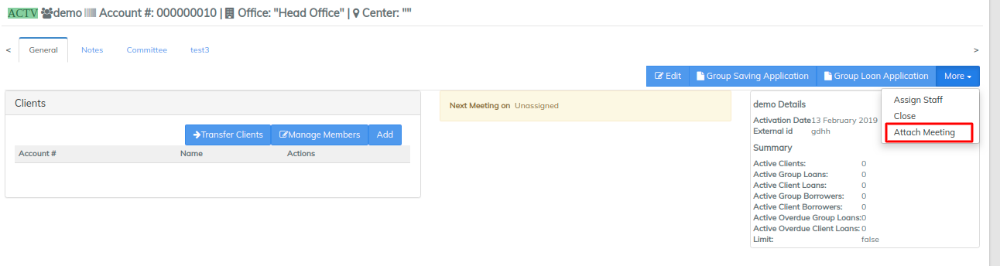
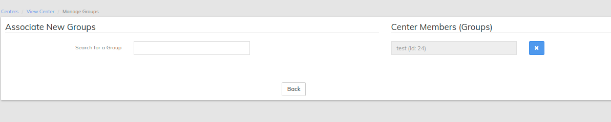

# Manage Centers

Beginning at the main screen, select **Clients** then select **Centers** from the drop-down menu. This will launch the Clients page.

#### **Create a Center** 

From LMS Home page, you can create a center in three different ways: Search Activities box, _Clients_ drop-down menu, or via the _Navigation_ bar.

* In _Search Activities_ box, start typing the text _create center_. The field auto-populates. Press _Enter_. The _Create Center_ page opens. Provide details in the following fields.
* Click _Clients_ drop-down menu. Select _Centers_ from the list. Click the **+Create Center button** at the top right corner of the page. The _Create Center_ page opens. Provide details in the following fields.

Point the cursor at the triangle at the left side of the screen. The navigation bar appears. Click on _**+Center in the navigation bar.**_ The _Create Center_ page opens. Provide details in the following fields.

| Field Name (attribute) | Description                                                                                                                          |
| ---------------------- | ------------------------------------------------------------------------------------------------------------------------------------ |
| Name                   | Provide the name for the center (Mandatory Field)                                                                                    |
| Office                 | Provide the office name to which the center is registered to. (Mandatory Field)                                                      |
| Staff                  | Mention the staff name. (You can select any one of the employees of the office to which the center is registered)                    |
| Active                 | Select this field to activate the center while creating it.                                                                          |
| Activation date        | A mandatory field that appears when you select Active. Enables you to activate your account for the current date or for a back date. |
| External id            | Provide some unique id (maybe alpha-numeric) which can be used as search parameter later.                                            |
| Submitted on           | Enables you to submit a center on a particular date.                                                                                 |
| Select and add groups  | From drop-down menu, select the existing groups and add them to the center by clicking '+' button.                                   |

4\) Click on 'Submit' button to create the center.&#x20;

#### **Import a Center** . 

From LMS home page, select Clients, then Centers

Select "Import Centers".&#x20;

The following page opens

* You can choose the office and staff with who you want to import a center and download a template for it. In the downloaded template, you fill in the required fields of all the centers you want to create.
* You can also choose an excel file of a center from your computer
* On the page above, you can see if any document has been imported and all the details as shown.

#### Attach Meeting to a Center 

You can attach meeting to _Center_. Attaching a meeting at the center level attaches it to all the groups within that center.

At the center level, navigate to the center. From the Center page, click on _More_ drop-down box. Select _Attach Meeting_ option. Fill in the following details:                                                &#x20;

Tip: Meeting can be created backdated also.&#x20;

\
Example showing attaching **Daily meeting**: i) Provide **Meeting start date** ii) Check the check box for **Repeat** if meeting is repeated with every provided schedule. iii) **Repeats**: select Dailyiv) **Repeats every**: 1 day\
\
\
Example showing attaching Weekly meeting: i) Provide **Meeting start date** ii) Check the check box for **Repeat** if meeting is repeated with every provided schedule. iii) **Repeats**: select Weekly iv) **Repeats every**: 1 week v) Select **Day** on which meeting should happen.(In the example below, it's on Wednesday)   \

.png>)

\
Example showing attaching **Monthly meeting**: i) Provide **Meeting start date** ii) Check the check box for **Repeat** if meeting is repeated with every provided schedule. iii) **Repeats**: select **Monthly**iv) **Repeats every**: 1 Month \

.png>)

### **Activate a Center** 

You can activate a center while creating it or in future. The status of the centers that have not been activated appear as _Pending_.

1. Navigate to the center you want to activate.&#x20;
2. Click Activate button.
3. Enter activation date. You may choose to activate on the current date or a back date.

You may also activate an existing center by choosing to edit it.

### **Edit an Existing Center** 

1. Navigate to the center you want to edit.
2. Click the **Edit** button available at the home page of that center.

You may edit the following fields:

| Field Name (attribute) | Description                 | Example | Validations (if applicable) |
| ---------------------- | --------------------------- | ------- | --------------------------- |
| Name                   | Provide the new center name |         |                             |
| Staff                  | Provide the new Staff name  |         |                             |
| External id            | Enter the new External id   |         |                             |
| Activation date        | Enter the Activation Date   |         |                             |

### &#x20;**Create a New Group and add to the Center**: 

1\) Go to the Specific Group and click on 'Add Group' tab to see the following window:

.png>)

2\) As shown above, enter the Group details and add the clients

3\)  Click on Submit button to create the group and add it to the center.

### **Add an existing Group to the Center**: 

1\) Go to the specific Group and click on 'Manage Groups' tab to see the following window:

&#x20;2\) Search the existing Group and add it to the center.

#### Center Saving Application: 

1\) Go the Specific Center and click on 'Center Saving Application' tab to open the saving Application.

2\) Select the existing Savings Product and furnish the remaining details. (to see how to create a saving account, )

3\) Click on **'Submit'** button to create a saving application for the center.

4\) Finally Approve and Activate the Saving Account.&#x20;

### **Close a Center** 

1. Navigate to the center you want to close.&#x20;
2. From the home page of that center, click **More**.
3. Select _Close_ from the drop-down menu. The _Confirm_ page opens.
4. Enter details for the following fields:

| Field Name (attribute) | Description                                                                                    |
| ---------------------- | ---------------------------------------------------------------------------------------------- |
| Closure date           |  Mandatory field that allows you to close center on the current or back date                   |
| Closure reason         |  Mandatory field that allows you to choose from the values defined in the Manage Code section. |

