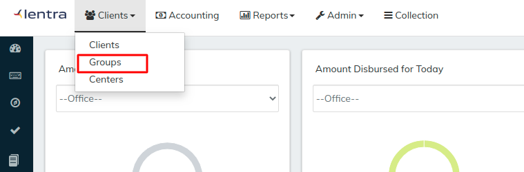
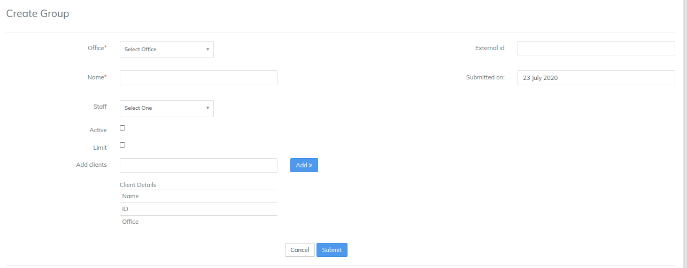
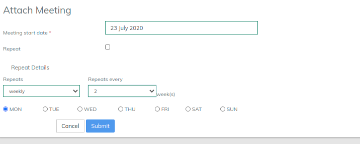
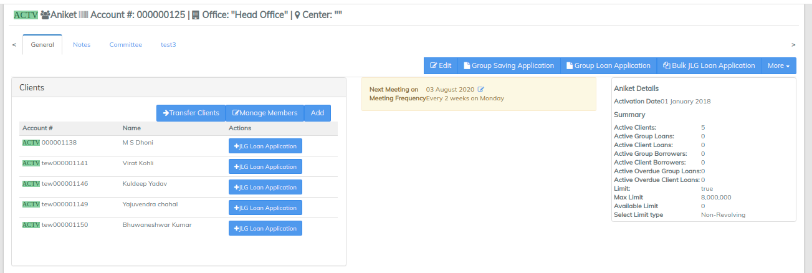
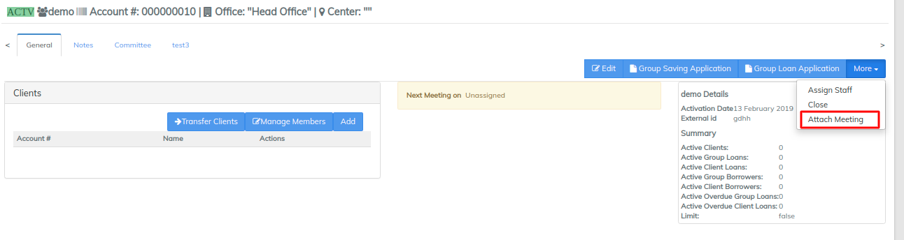
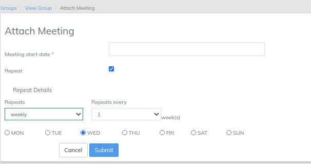
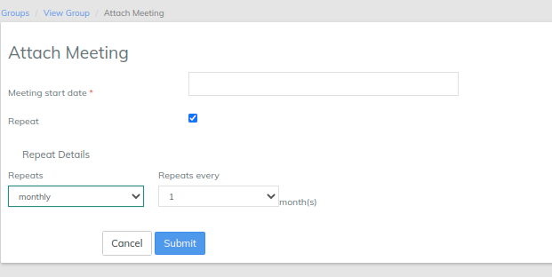
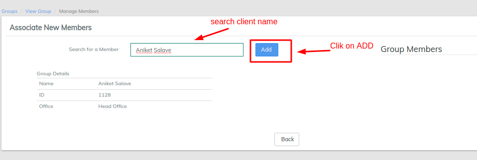
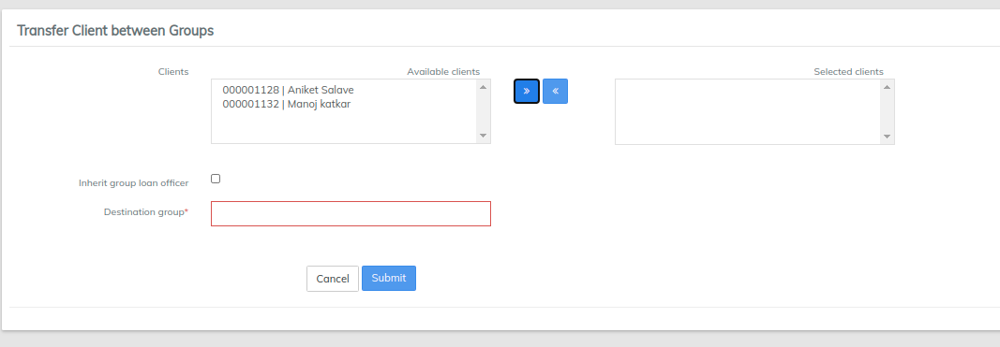

# Manage Groups

**Groups include more than one client and are created to provide Groups Loans, JLG loans and Group Savings to the whole group rather than a single client.**&#x20;

**On this page:**

* [Create a New Group](https://mifosforge.jira.com/wiki/spaces/docs/pages/67895334/Manage+Groups#ManageGroups-CreateaNewGroup)
* [Assign Staff to a Group](https://mifosforge.jira.com/wiki/spaces/docs/pages/67895334/Manage+Groups#ManageGroups-AssignStafftoaGroup)
* [Attach Meeting to a Group](https://mifosforge.jira.com/wiki/spaces/docs/pages/67895334/Manage+Groups#ManageGroups-AttachMeetingtoaGroup)
* [Edit Group Details](https://mifosforge.jira.com/wiki/spaces/docs/pages/67895334/Manage+Groups#ManageGroups-EditGroupDetails)
* [Associate Existing Clients/members with a Group](https://mifosforge.jira.com/wiki/spaces/docs/pages/67895334/Manage+Groups#ManageGroups-AssociateExistingClients/memberswithaGroup)
* [Assign New Members to an Existing Group](https://mifosforge.jira.com/wiki/spaces/docs/pages/67895334/Manage+Groups#ManageGroups-AssignNewMemberstoanExistingGroup)
* [Transfer Clients between Groups](https://mifosforge.jira.com/wiki/spaces/docs/pages/67895334/Manage+Groups#ManageGroups-TransferClientsbetweenGroups)

&#x20; Beginning at the main screen, select **Clients** then select **Groups** from the drop-down menu. This will launch the Groups page.

#### **Create a New Group** 

From LMS home page, there are 3 (three) ways of _creating a group_: Search Activities box, _Clients_ drop-down menu, or via the _Navigation_ bar.&#x20;

1. In _Search Activities_ box, start typing the text _create group_. The field auto-populates. Press _Enter_. The _Create Group_ page opens. Provide details in the following fields. Or
2. Click _Clients_ drop-down box. Select _Groups_. Click on **+CreateGroup**_._ The _Create Group_ page opens.&#x20;

\

1.  &#x20;Once the _Create Group_ page opens. Provide details in the following fields taking note that the fields with  **asterisk**(\*) are mandatory.

    | Field Name (attribute) | Description                                                                                           | Example | Validations (if applicable) |
    | ---------------------- | ----------------------------------------------------------------------------------------------------- | ------- | --------------------------- |
    | Office                 | From drop-down menu, select the office to which the clients belong to in order to create their group. |         |                             |
    | Name                   | Provide the name for the group (Mandatory Field)                                                      |         |                             |
    | Staff                  | From drop-down menu select the available staff belonging to the particular office.                    |         |                             |
    | Add Clients            | Allows you to select from a list of available clients                                                 |         |                             |
    | Active                 | Allows you to activate the group for specific date.                                                   |         |                             |
    | Activation date        | Allows you to select a current or back date                                                           |         |                             |
    | External id            | Provide External Id for the group                                                                     |         |                             |
    | Submitted on           | Provide the submission date of the created group.                                                     |         |                             |

    Once the group is Created, The next step is to assign the meeting date for the group. In order to assign the meeting date, go to the group and click on 'More' tab and then click on "Assign Meeting Date" to see the following window:

1.  After that, the window of a specific group looks like the image below:

1. As shown in the image above, the Group's window displays:\
   i) The list of Clients in the group\
   ii) Group's next meeting date, meeting frequency and meeting day.\
   iii) Group Activation Date, Staff and External Id\
   iv) Number of Active Clients, Active Group loans, etc.&#x20;

#### **Assign Staff to a Group** 

1. From the list of existing groups, navigate to the group you want to assign staff to.
2. From the _More_ drop down menu, select _Assign Staff_. The _Assign Staff_ page opens.
3. Select staff from the drop-down menu.&#x20;
4. Click **submit**.

#### **Attach Meeting to a Group** 

You can _attach meeting_ to a group at the _Center_ or _Group level_. Attaching a meeting at the center level attaches it to all the groups within that center.

At the group level, navigate to the group. From the Group page, click on _More_ drop-down box. Select _Attach Meeting_ option. Fill in the following details:                                                                          &#x20;

Tip: Meeting can be created backdated also.&#x20;

\
Example: showing attaching **Daily meeting**: i) Provide **Meeting start date** ii) Check the check box for **Repeat** if meeting is repeated with every provided schedule. iii)**Repeats**: select Dailyiv) **Repeats every**: 1 day\
\
&#x20;

.png>)

\
Example showing attaching Weekly meeting: i) Provide **Meeting start date** ii) Check the check box for **Repeat** if meeting is repeated with every provided schedule. iii) **Repeats**: select Weekly iv) **Repeats every**: 1 week v) Select **Day** on which meeting should happen.(In the example below, it's on Wednesday) &#x20;

\
Example showing attaching **Monthly meeting**: i) Provide **Meeting start date** ii) Check the check box for **Repeat** if meeting is repeated with every provided schedule. iii) **Repeats**: select **Monthly**iv) **Repeats every**: 1 Month \

**Sync Meeting Dates with Repayment Schedule**

1. Navigate to the group you want to sync meeting dates with repayment schedule.
2. In the Group page, click the ** **_**+Group Loan Application**_** page**. The New Loan Application page opens.
3. Select the loan product from the Product drop-down menu. The product list choices depend on ??. Selecting the loan product enables other fields on the page.
4. Make sure the _Sync repayments with meeting_ option is selected.
5. Click _Submit_ button.

**Sync meeting dates with disbursement schedule**&#x20;

1. Navigate to the group you want to sync meeting dates with repayment schedule.
2. In the Group page, click the _+Group Loan Application_ page. The New Loan Application page opens.
3. Select the loan product from the Product drop-down menu. The product list choices depend on ??. Selecting the loan product enables other fields on the page.
4. Make sure the _Sync disbursement date with meeting_ option is selected.
5. Click _Submit_ button.&#x20;

#### Edit Group Details 

1. From the list of existing groups, navigate to the group whose details you want to edit.&#x20;
2. From the _Group_ page, click _Edit_ button. The _Edit Group_ page opens.
   1.
      1.  Edit the following details.

          | Field Name (attribute) | Description                              | Example | Validations (if applicable) |
          | ---------------------- | ---------------------------------------- | ------- | --------------------------- |
          | Name                   | mandatory field                          |         |                             |
          | Staff                  | Provide the new staff name               |         |                             |
          | External id            | Provide the external id for the group    |         |                             |
          | Activation date        | Provide the activation date of the group |         |                             |

#### Associate Existing Clients/members with a Group 

1. From the list of existing groups, navigate to the group you want to associate members to.&#x20;
2. In the _Group_ page, click on _Manage Members_ tab to see the following window.\

1. Click **Add** button to associate the new existing member to the group. \
   \

#### Assign New Members to an Existing Group 

1. From the list of existing groups, navigate to the group you want to add members to.&#x20;
2. In the _Group_ page, click **Add** tab to create a client .
3. Enter the details of the client ([See here](https://mifosforge.jira.com/wiki/spaces/docs/pages/67895338/Manage+Clients) for how to enter the details of the client) and click submit button to add the client to the group.&#x20;
4. Click Submit to create the client and associate him to the group.&#x20;

#### Transfer Clients between Groups 

1. From the list of existing groups, navigate to the group you want to transfer clients from.&#x20;
2. In the _Group_ page, click _on Transfer Clients_ tab to see the following window:\
   \

1. Select the desired clients and click on **">>"** button and select the destination group.
2. Click on **submit** button to transfer the clients to destination group.

&#x20; Click Here to see How to create Group Saving Account

&#x20; Click Here to see How to create Group Loan Account

&#x20; Click Here to see How to process Bulk JLG Loan Application

_**Explanation of how this differs with LMS**_&#x20;

In LMS the concept of the group meeting and its schedule were rigidly constructed that closely affected every aspect of the client, group, center, loan. Being so central, made setting up these meetings very intuitive, but also very difficult and hard to support anything outside of this meeting behavior. The functionality for configuring group meetings is a little hidden in LMS so that's why we need this explanation section.&#x20;
