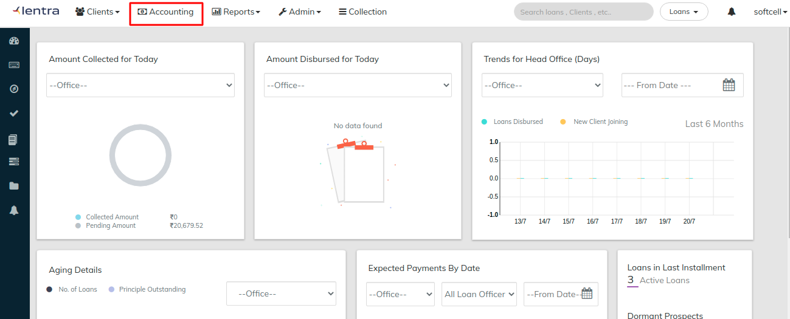

# Accounting

To access the [Accounting](../accounting/) menu and the options within, click on the **Accounting** button on the top of the screen: &#x20;

To **Enable Accounting Module** you need to follow the mandatory step by step instructions below before you do any transaction:- &#x20;

Step 1) Create chart of accounts -&#x20;


[chart-of-accounts.md](../accounting/chart-of-accounts.md)


Step 2) Map opening balance contra account


[migrate-opening-balances.md](../accounting/migrate-opening-balances.md)


Step 3) Pass opening balance entries - [Migrate opening balances(Office wise)](https://mifosforge.jira.com/wiki/pages/viewpage.action?pageId=90243328) &#x20;

Step 4) Map your products with respective accounts - Once the Products are defined, come back to this section and follow the steps.  &#x20;

* Go to >> Loan Products - Accounting&#x20;
