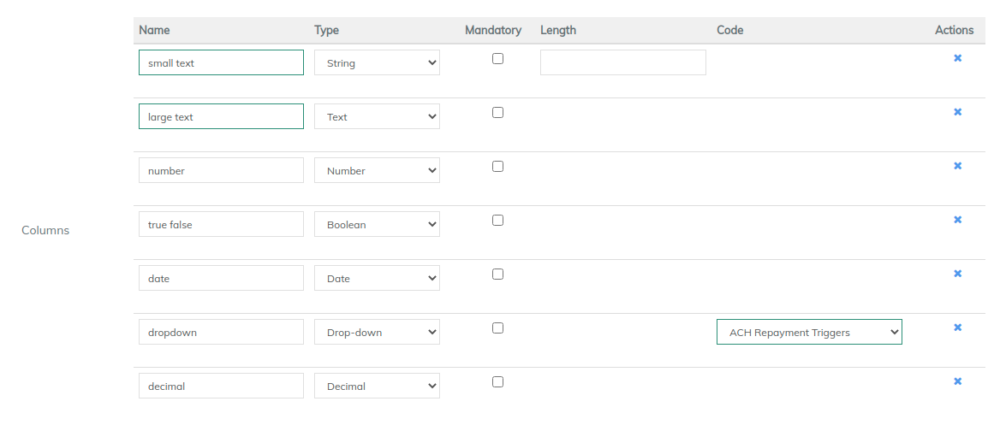

# Create Data Tables

Go to **Admin>System**

LMS data-table allows the user to add custom fields in addition to the built-in fields to a client profile, loan/saving account, group, center or a office. When creating a set of custom fields (i.e, data-table), you can set multi-row option to capture multiple instance of data. And custom field supports 6 data types (String, Number, Decimal, Date, Text and Drop down). Review the system provided data tables then, using your Pre-Configuration Guide, create additional fields in this area.

&#x20;__ Select "**Create Data table**"

The **Application table name** field will provide a drop down of system functions the data table will affect. Options are

* Loan : Attach additional table to loan
* Client : Attach additional table to client
* Office : Attach additional table to office
* Group : Attach additional table to group
* User : Attach additional table to user

**Multi Row:** If you want to store more than one record per entity. i.e. client or loan then tick the multi row flag. Example- If you want to store only one bank account per client, then disable it. Else, if no. of bank accounts are more than one, then enable it.&#x20;

To add **Columns**, enter name, and from drop down select type&#x20;

* String: It is small text. You can specify the max length of the field
* Number: It is integer field
* Decimal: It will decimal field, which will allow number to be in decimal
* Boolean: It will checkbox
* Date: it will allow to select date using datepicker
* Date-time: It will allow to select date and time using picker
* Text: It is large lenght text
* Dropdown: It is dropdown. Dropdown value can be selected by creating [custom codes](../administration/system/manage-codes.md)

