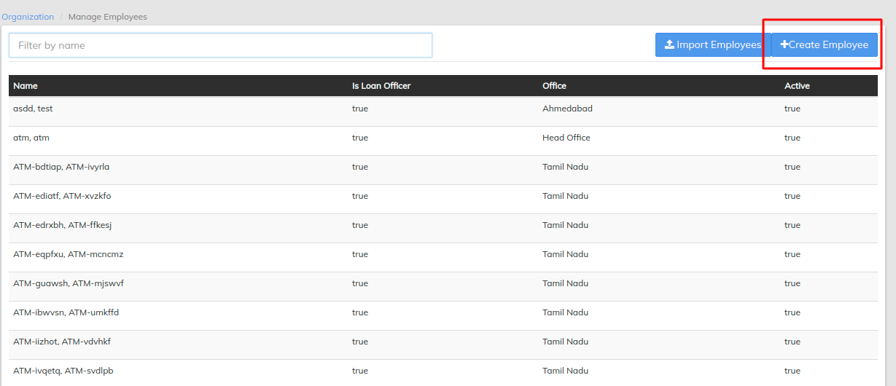
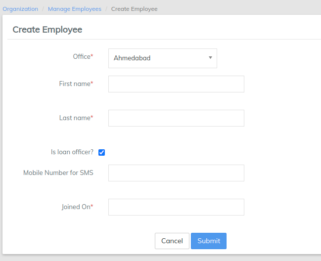

# Create Employees

Click the blue **Create Employee** button at the top-right of the page to create a new employee.

1. Complete the required fields:
   1. Select the appropriate office from the drop-down menu
   2. First name
   3. Last name
   4. Designate the employee as a loan officer if that is the case (optional)
2. Optional - Add a Mobile Number for SMS messaging.
3. Provide the Joining Date of the employee.&#x20;
4. Click **Submit**.


Employees are different than users. You have to create seperate users for each employee. While some employees can be in the system for reporting purpose, and need to require user login credentials

