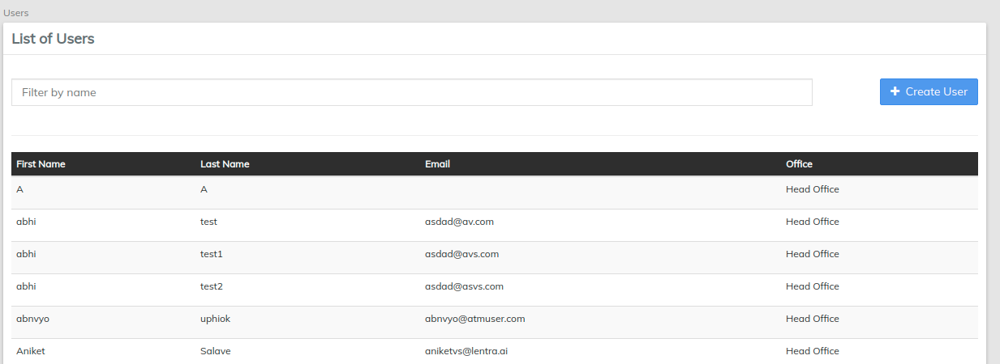

# Create Users

Return to the **Admin Screen** and select **** [**Users** ](../administration/users.md)****

Select Create User, add the user's details and submit.


[users.md](../administration/users.md)


