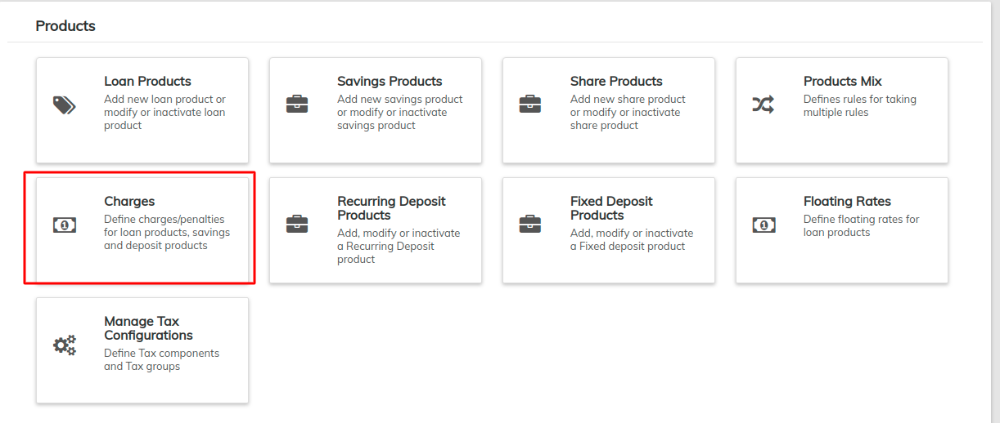

# Define Charges

Go to **Admin>>Products** Screen and select [**Charges** ](../products-1/charges.md)****

In order to attach charges to products, you need to define charges at this point. Later at the time of defining product, you could add charges by just selecting it from drop-down.&#x20;

To create charge, please refer link:-&#x20;


[charges.md](../products-1/charges.md)


