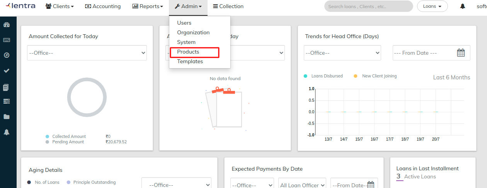

# Define Product Defination

Go to **Admin>>**[**Products.**](../products-1/)****

Products are set up once and are then available to qualifying clients (individuals, groups, and centers).

To define Products click on respective mentioned links below:&#x20;


[products-1](../products-1/)

