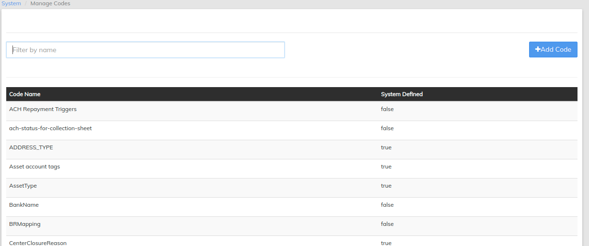

# Define System Codes

Return to the **Admin/System** Screen, then select [**Manage Codes**](../administration/system/manage-codes.md)  - For defining system codes for examples - Payment types, Collateral, etc.

Codes are mostly **system defined** which means the code itself comes out of the box and cannot be modified. However, its code values can be. e.g. 'Customer Identifier', it defaults to a code value of "Passport" but could be "Drivers License", "National Id" or any other ID acceptable to your organization.

Review the list of system defined codes, then edit as needed for your operations.  For more information on code configuration, see [**Manage Codes**](../administration/system/manage-codes.md)**.**
