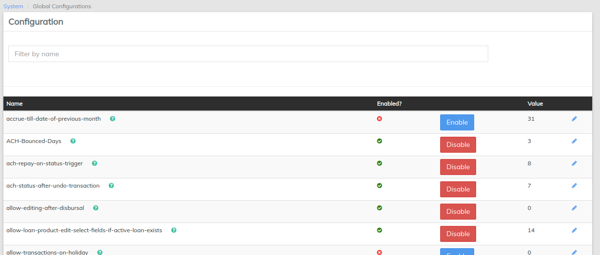

# Global Configuration

Return to the **Admin/System** page, then select **Configuration.**

&#x20;__ Some of the important Global Configurations to setup are below:

1. **maker-checker** - defaults to false - if true turns on maker-checker functionality
2. **reschedule-future-repayments** - defaults to false - if true reschedule's repayments which falls on a non-working day to configured repayment [rescheduling rule](https://demo.openmf.org/api-docs/apiLive.htm#nw\_repayment\_schedule\_rule)
3. **allow-transactions-on-non\_working days** - defaults to false - if true allows transactions on non-working days
4. **reschedule-repayments-on-holidays** - defaults to false - if true reschedules repayments which falls on a non-working day to defined [reschedule date](https://demo.openmf.org/api-docs/apiLive.htm#holidays)
5. **allow-transactions-on-holiday** - defaults to false - if true allows transactions on [holidays](https://demo.openmf.org/api-docs/apiLive.htm#holidays)&#x20;

****
