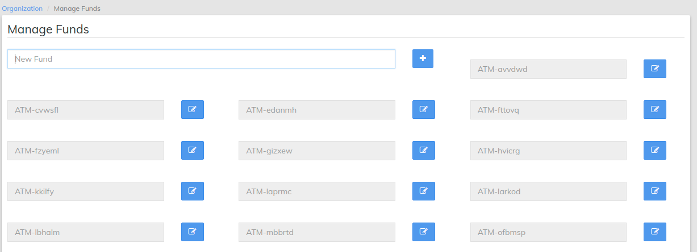

# Setting up your Fund Source

Return to the **Admin/Organization** Screen and select [**Manage Funds.** ](../administration/organization/manage-funds.md)****

If your organization has funds that are to be used for specific lending purposes, the names are defined here. In the example below the new fund "Rotary Internal Agriculture Loan 2014" has been entered into the "New Fund" field. Loans that are made to customer that fall into this category will link to the fund to enable the organization to properly monitor fund use and to provide reports. After the fund name has been entered, click on the "+" to add the fund to the list.

