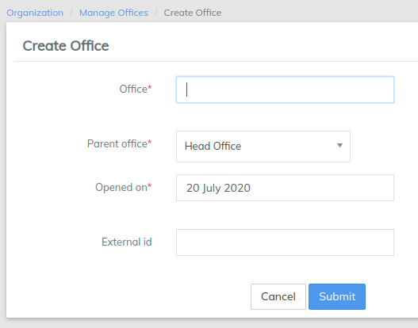

# Setup Offices

* The first step is to create the Main Office of your organization. In this example, we use the name "Head Office". You enter the name that best describes your office name. This may be a building name, a road name or any other naming scheme your particular organization uses.
* In the **Office** field, enter your main office name.
* In **Parent Office**, do not enter a name.
* In the **Opened** on field, enter the date your organization opened this office.
* In the **External ID** field, enter any numeric identifier your organization may use to further identify your offices. This is an optional field provided for your unique customization. It is not required for effective LMS functionality.

Review the information entered and if it is all correct, click on the **Submit** button. The head office is now created.

If your organization has multiple offices, return to the **Admin/Organization/Manage Office's** screen and select **+Create Office**. In this example, we use the name "_Branch Office_".  You will enter the name that best describes your additional office name.


It is best to set up your head office first. Then set up any regional offices. Finally set up the individual branch offices taking care to link them to the correct regional or **Parent office.**



[manage-offices.md](../administration/organization/manage-offices.md)


