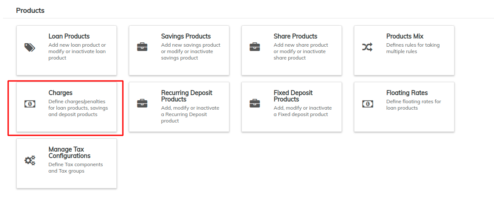
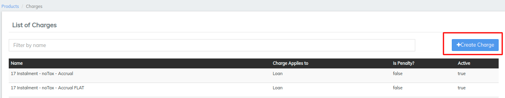
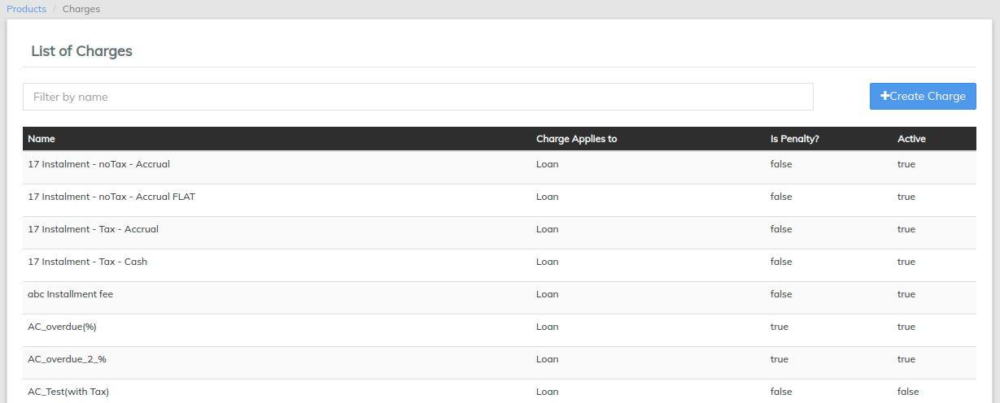

# Charges

It supports Loan charges and Client Charges.&#x20;

Beginning at the main screen, select **Admin**, **Products** from the drop-down menu. This will launch the **Products** menu. Select **Charges**.

## **Creating a Charge**

Click on **+Create Charge**.

### **Loan charge**&#x20;

**1.**Select **Charges apply** to as **Loan**.&#x20;

2\. Fill in the charge fields described in the **Charge Fields table** below.

3\. Select **Charge time type**&#x20;

* **Disbursement**: Gets charged at the time of loan disbursement. You can choose to net-off this amount or collect seperately at product level configurations
* **Specified due date**: Charges can be added at any date in the loan life cycle or can be future dated as well.&#x20;
* **Installment Fee**: Gets charged on every loan installment
* **Overdue Fees**: Gets charged if there is an overdue, this is a **penalty** charge.&#x20;
* **Tranche Disbursement**: Gets charged for Tranche loan disbursement. This is only applicable for the Constant EMI tranche disbursement
* **Top Up**: Charge gets added if you are giving a top-up loan on the existing parent loan
* **Incremental EMI tranche disbursement**. This charge will be collected at disbursment of each tranche
* **Foreclosure Fee**: This charge gets applied at the time of foreclosing the loan
* **ACH bounce fee**: This charge gets added automatically when any ACH is bounced
* **PDC bounce fee**: This charge gets added automatically when any PDC (cheque) is bounced

4\. Select **Charge Calculation**

* **Flat:** It is a flat charge.&#x20;
* **% Approved Amount:** $$Approved Amount * Percentage of charge$$&#x20;
* **% Loan Amount + Interest:** $$EMI * percentage charge$$&#x20;
* **% Interest:** $$EMI Interest * Charge Percentage$$&#x20;
* **% Of TopUp Amount :** $$Topup Loan Amount * Percentage Charge$$&#x20;

5\. Select **Charge payment By**

Select Regular Mode

6\. Select **Active:**&#x20;

Keep this flag ticked

7\. Select **Tax Group**&#x20;

To create Tax group, you need to create [Tax component](taxation.md#create-tax-components) and [Tax groups](taxation.md#create-tax-group) first

8\. Click **Submit**.

## View Charges

## View / Edit Charges

