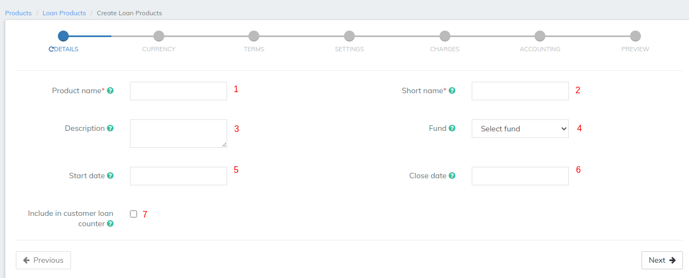

# Basic Details

Please refer to the above **Details - Image**, Mentioned details below are updated with respect to the provided fields numbers.  &#x20;

1. Provide **Loan Product name** .(Mandatory)&#x20;
2. Provide **Short name**. (Mandatory)&#x20;
3. Provide description of this product.
4. Select Fund source. Need to have defined required funds: [Manage Funds](../../administration/organization/manage-funds.md).&#x20;
5. Provide Loan product Start date.
6. Provide Loan product Close date. Note - Loan product cannot be used after this date.
7. On checking the check box, it captures the number of loans taken by the customer.

| Field Name (attribute)        | Description                                                                                                                                                                                                                                                                                                                                                                                                                                                                                                                                                                                                                                                                                                                                                                                                                                                                                                                                                                                                                                                                                                                                                           | Example                                           | Validations (if applicable)                                           |
| ----------------------------- | --------------------------------------------------------------------------------------------------------------------------------------------------------------------------------------------------------------------------------------------------------------------------------------------------------------------------------------------------------------------------------------------------------------------------------------------------------------------------------------------------------------------------------------------------------------------------------------------------------------------------------------------------------------------------------------------------------------------------------------------------------------------------------------------------------------------------------------------------------------------------------------------------------------------------------------------------------------------------------------------------------------------------------------------------------------------------------------------------------------------------------------------------------------------- | ------------------------------------------------- | --------------------------------------------------------------------- |
| Product name                  | 
The product name is a unique identifier for the lending product. The product name is used:
<ul><li>In <strong>Product</strong> lists (depending on where the product list appears, it may contain a list of all loan products or a list of active loan products).</li><li>As the <strong>Loan Account</strong> identifier in the <strong>Loan Account Overview</strong> section on the client <strong>General</strong> tab.</li><li>In the <strong>Name</strong> column in the list of loan products displayed when <strong>Loan Products</strong> is clicked on the Products page.</li><li>In <strong>Product</strong> drop-down list on the <strong>Loan Reports</strong>' <strong>Run Report</strong> page.</li><li>In the <strong>Product</strong> column in some Loan Reports.</li><li>As the <strong>Loan Account</strong> identifier at the top of the detail loan product page displayed when a specific loan product is selected from the list of loan products displayed when <strong>Loan Products</strong> is clicked on the Products page.</li><li>In the <strong>Product name</strong> field to create a <strong>Loan Product.</strong></li></ul> | Home Loan, Business Loan                          | 
Required field

Alphanumeric

Maximum 100 characters
 |
| Short name                    | 
The short name is a unique identifier for the lending product. The short name is used:
<ul><li>In the <strong>Short name</strong> column in the list of loan products displayed when <strong>Loan Products</strong> is clicked on the Products page.</li><li>On the Collection Sheet, to identify the loan product a loan account is based on.</li><li>In the <strong>Short name</strong> field on the detail savings product page displayed when a specific loan product is selected from the list of loan products displayed when <strong>Loan Products</strong> is clicked on the Products page.</li><li>In the <strong>Short name</strong> field to create a <strong>Loan Product.</strong></li></ul>                                                                                                                                                                                                                                                                                                                                                                                                                                                       | BldA                                              | 
Required field

Alphanumeric

Maximum 4 characters
   |
| Description                   | 
The description is used to provide additional information regarding the purpose and characteristics of the loan product. The description is used:
<ul><li>To create a <strong>Loan Product.</strong></li><li>In the <strong>Description</strong> field on the detail savings product page displayed when a specific saving product is selected from the list of savings products displayed when <strong>Saving Products</strong> is clicked on the Products page.</li><li>In the <strong>Description</strong> field to create a <strong>Loan Product.</strong></li></ul>                                                                                                                                                                                                                                                                                                                                                                                                                                                                                                                                                                                        | Home Loan  is available for new construction only | 
Alphanumeric

Maximum 500 characters
                      |
| Fund                          | Loan products may be assigned to a fund set up by your financial institution. If available, the fund field can be used for tracking and reporting on groups of loans. If your financial institution has set up funds, the **Fund** list will be populated and you will be able to select a fund.                                                                                                                                                                                                                                                                                                                                                                                                                                                                                                                                                                                                                                                                                                                                                                                                                                                                      | Dropdown                                          | May be left blank or select from list.                                |
| Start date                    | 
The date that the loan product will be active and available to clients. If blank, the loan product will be active as soon as it is created.

Select the date from the calendar popup.
                                                                                                                                                                                                                                                                                                                                                                                                                                                                                                                                                                                                                                                                                                                                                                                                                                                                                                                                                                     | 01 Jan 2013                                       | 
Date

dd mm yyyy
                                          |
| Close date                    | 
The date that the loan product will become inactive and unavailable to clients. If blank, the load product will never become inactive.

Select the date from the calendar popup.
                                                                                                                                                                                                                                                                                                                                                                                                                                                                                                                                                                                                                                                                                                                                                                                                                                                                                                                                                                          | 31 Dec 2020                                       | 
Date

dd mm yyyy
                                          |
| Include borrower loan counter | 
A borrower loan counter (cycle) is used for tracking how many time the client has taken this particular product. This is useful for measuring social indicators with each loan a client has taken. It is used for PPI related reporting.

Check this checkbox to include a loan counter for a borrower (<em>client</em>). Uncheck this checkbox to not include a loan counter for a borrower (<em>client</em>).
                                                                                                                                                                                                                                                                                                                                                                                                                                                                                                                                                                                                                                                                                                                                           |                                                   |                                                                       |
