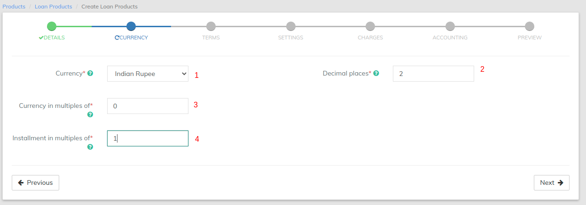

# Currency

1. Select **Currency** (Mandatory). Need to have defined required currency: [Currency Configuration](https://mifosforge.jira.com/wiki/spaces/docs/pages/67141734/Currency+Configuration)
2. Provide **Decimal places** (Mandatory).
3. &#x20;Provide **Currency in multiples of** (Mandatory). This is to provide total amount rounding off. For example: 10, so Total amount gets rounded off to 10's.&#x20;
4. Provide I**nstallment in multiples of** (Mandatory). This is to provide installment rounding off. For example: 10, so Installment amount gets rounded off to 10's.

| **Attribute**               | Description                                                                                                                                                                           | Sample | Validation                                                    |
| --------------------------- | ------------------------------------------------------------------------------------------------------------------------------------------------------------------------------------- | ------ | ------------------------------------------------------------- |
| Currency                    | The currency in which the loan will be disbursed. Currencies are set up by your financial institution. Select the loan product's currency from the **Currency** list.                 |        | Required field                                                |
| Decimal places              | The number of decimal places to be used to track and report on loans.                                                                                                                 | 2      | 
Required field

Numeric

Values (0,1,2,3,4)
  |
| Currency in multiples of    | 
You can enter multiples of currency value. For example, if you put "multiples of 100", the currency value will be rounded off to 200, 300, 400, etc.

For 10, it will be 
 | 0      | 
Required field

Numeric

Values (0,1,10,100)
 |
| Installment in Multiples of | You can mention rounding of the installments. For Example, if you enter 1, then all installments will be integers                                                                     | 1      | 
Required field

Numeric

Values (0,1,10,100)
 |

&#x20;
