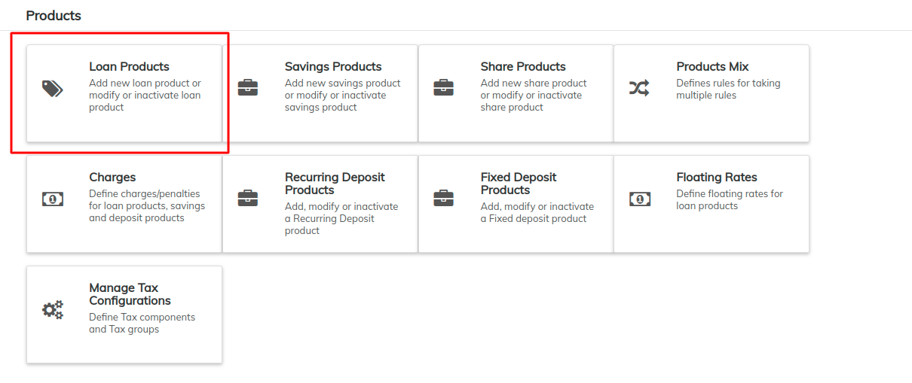
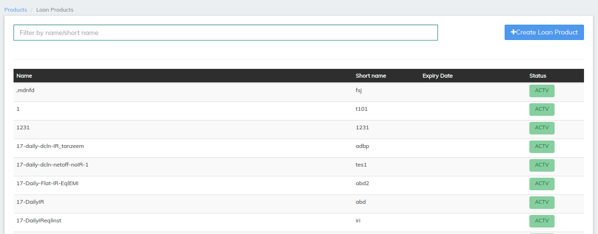
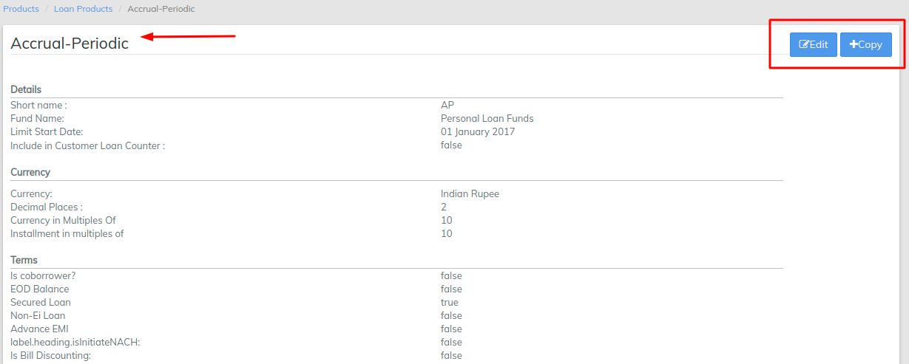

# New Product Creation

## Create loan product

The information required to set up a loan product includes:

* Identifying or descriptive information&#x20;
* Currency information&#x20;
* Terms
* Settings
* Tranche
* Charges
* Accounting

Beginning at the main screen, select **Admin**, then **Products** from the drop-down menu. This will launch the **Products** menu.

Select **Loan Products.**&#x20;

The Loan Products page will be displayed as shown below;

#### Click on the blue "Create Loan Product" shown on the image above. 

## View / Edit Loan Product&#x20;

&#x20;Go to Admin>>Product>>Loan Products&#x20;

## **Copy Product**

Using the copy button you can create a replica of the same parent product.&#x20;


You need to change the product name and Short name in order to save the newly copied product

