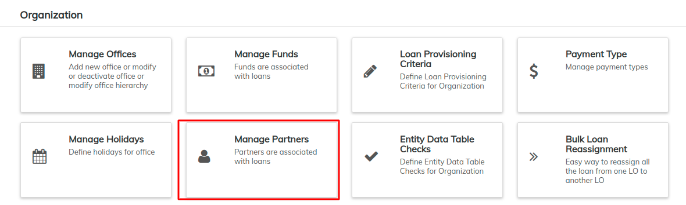
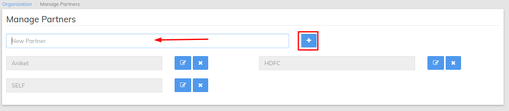

# Co-Lending

By definition, co-lending is when a fintech firm comes together with a traditional lender, to disburse loans. The association allows fintech firms to source clients, perform credit appraisals and disburse a small part of the loan amount

The sharing of the co-lending can be done in any percentage. You can also add multiple partners in co-lending (more than one partner)

**Step1: Create Partners**

You need to create partners by going to Organization >> Manage Partners

You can create new partner by entering the name and clicking on  + button

**Step 2: Enable Co-lending Loan**

Tick on the enable co-lending flag

**Step3: Enter the shares for each partner**

Self is your own organization. You can add shares to below components

* **Principal - % Of Principal**&#x20;
* **Interest - % Of Interest**&#x20;
* **Fees/Penalty - % Of Fees/Penalties**&#x20;
* **Overpaid - % Of Overpaid**&#x20;

.png>)

Example -&#x20;

If you are giving a loan of 100000 with your part as 80%, then you can enter 80 in **Self Shares** and 20 in Partner shares

If you are charging interest rate of 8% and partner is charge interest rate of 12% then you can give  a loan of 20% nominal interest rate and Self shares of 40 and Partner share of 60 for interest component

****
